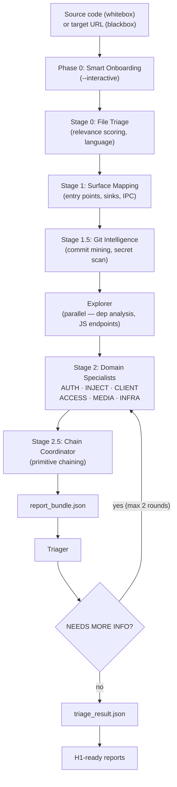
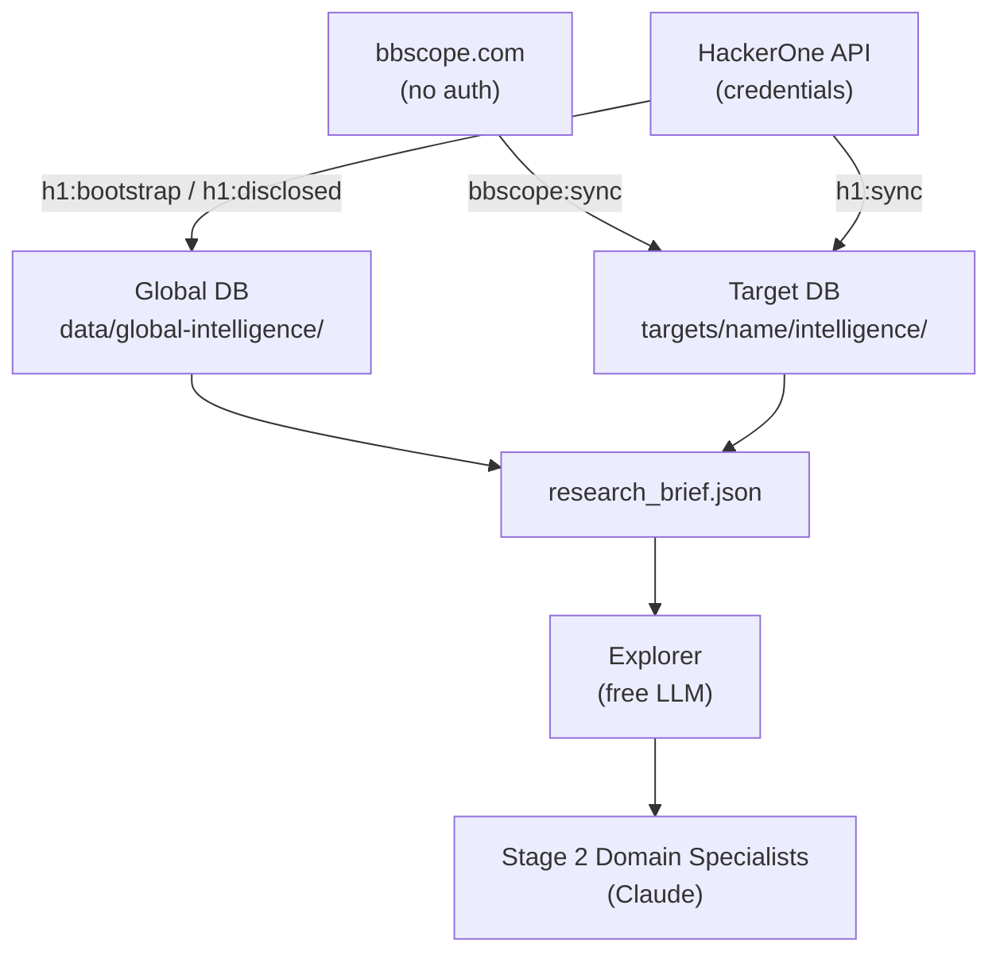
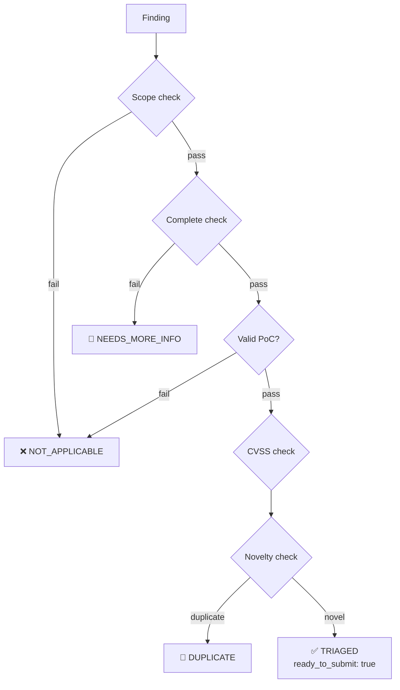

# Agentic BugBounty — Complete Guide

> **Design philosophy**: built around whitebox analysis — clone the source, point the agent at it, get deep findings with file:line precision and working PoCs. Blackbox mode is supported for targets where source is unavailable, but whitebox is the primary mode and delivers significantly higher signal quality.

---

## Table of Contents

1. [How it works](#how-it-works)
2. [Phase 0: Smart Onboarding](#phase-0-smart-onboarding)
3. [Stage 0: File Triage](#stage-0-file-triage)
4. [Stage 1: Surface Mapping](#stage-1-surface-mapping)
5. [Stage 1.5: Git Intelligence](#stage-15-git-intelligence)
6. [Stage 2: Domain Specialists](#stage-2-domain-specialists)
7. [Stage 2.5: Chain Coordinator](#stage-25-chain-coordinator)
8. [Explorer agent](#explorer-agent)
9. [Adaptive Recon Loop](#adaptive-recon-loop)
10. [HITL Checkpoints](#hitl-checkpoints)
11. [FP Registry](#fp-registry)
12. [Analysis modes](#analysis-modes)
13. [Target workspace](#target-workspace)
14. [Running the pipeline](#running-the-pipeline)
15. [Live agent output](#live-agent-output)
16. [PoC artifacts and summary](#poc-artifacts-and-summary)
17. [Session resume (Claude Pro usage limits)](#session-resume-claude-pro-usage-limits)
18. [Intelligence sources](#intelligence-sources)
19. [bbscope](#bbscope)
20. [HackerOne intelligence](#hackerone-intelligence)
21. [Skill library](#skill-library)
22. [CVE intel](#cve-intel)
23. [Training dataset export](#training-dataset-export)
24. [OpenRouter — free models + key rotation](#openrouter--free-models--key-rotation)
25. [Intel UI](#intel-ui)
26. [Direct agent invocation](#direct-agent-invocation)
27. [JSON contracts](#json-contracts)
28. [Validation](#validation)
29. [Package scripts reference](#package-scripts-reference)
30. [Environment variables](#environment-variables)

---

## How it works

The v2 pipeline runs seven sequential stages, each purpose-built for one layer of the analysis.



**One command runs everything.** `node scripts/run-pipeline.js` runs all stages in order. You do not need to invoke them separately unless you want manual control.

**Phase 0 (Smart Onboarding)** — activated by `--interactive`. Runs a structured Q&A session (scope, target version, research focus, CVE context, credentials, extra notes) and presents a session summary for confirmation before any analysis begins.

**Stage 0 (File Triage)** — deterministic file walk using a cheap LLM pass. Every file in the target gets a `relevance_tag` (config, routing, auth, crypto, etc.) and language detection. The resulting manifest drives all subsequent stages — only relevant files are analysed.

**Stage 1 (Surface Mapping)** — LLM-driven extraction of entry points, data sinks (`eval`, `innerHTML`, `exec`, query builders), IPC/messaging channels, external comms, and tech fingerprints. Output is a structured attack surface JSON injected into every domain researcher prompt.

**Stage 1.5 (Git Intelligence)** — mines the git history for security-relevant commits (auth, fix, secret, cve, patch), maps commit authors by file area, runs a secret scan across the working tree, and extracts removed code from diff bodies.

**Stage 2 (Domain Specialists)** — six parallel-capable researcher agents, each focused on one attack domain. Each agent writes its candidate pool to a separate shard (`candidates_pool_<DOMAIN>.json`) to avoid Windows file-locking on concurrent writes. Agents: AUTH (session, OAuth, JWT), INJECT (SQLi, SSTI, XXE, command injection), CLIENT (XSS, CSRF, postMessage, FontLeak), ACCESS (IDOR, path traversal, SSRF), MEDIA (file upload, path traversal, parser quirks), INFRA (headers, CORS, dependency CVEs).

**Stage 2.5 (Chain Coordinator)** — reads all domain findings and hunts for exploit chains. Uses a primitive matrix of 30+ chain patterns (e.g. SSRF→IDOR→exfil, XSS→CSRF→priv-esc, SQLi→file_read→RCE). Adds `chain_meta` to the bundle for confirmed chains.

**Explorer** — parallel surface mapper launched before Stage 2. Runs dependency analysis, JS endpoint extraction, HTTP fingerprinting, and secret detection using the deterministic Python parser (`parser.py` via `parser-bridge.js`). Output injected into all domain prompts.

**Triager** — runs six checks on every finding: scope, completeness, validity, CVSS reassessment, novelty (duplicate detection), and submission decision. Findings that need clarification get flagged as `NEEDS_MORE_INFO`, which triggers a second Stage 2 pass. This loops up to `--max-nmi-rounds` times (default 2).

**Deterministic fallback**: if the Triager agent fails to write `triage_result.json`, the pipeline runs a local Node.js triage pass with the same six checks.

---

## Phase 0: Smart Onboarding

Activated with `--interactive`. Runs before any file analysis.

```bash
node scripts/run-pipeline.js --target acme --cli claude --interactive
```

The onboarding Q&A covers:

| Question | Purpose |
|----------|---------|
| Scope restrictions | Constrains agent focus |
| Target version | Enables CVE matching |
| Research focus (full / auth / client / inject / …) | Loads matching domain modules |
| Known CVE / patch to test | Seeds bypass module |
| Test environment URL | Sets live test base URL |
| Credentials available? | Unlocks authenticated test paths |
| Extra context | Free-form notes injected into all prompts |

After the Q&A, the pipeline prints a session summary and waits for confirmation before proceeding. Phase 0 is skipped on `--resume` runs.

---

## Stage 0: File Triage

Runs automatically at the start of every pipeline run. Not user-configurable.

Walks every file in `source_path`, assigns a `relevance_tag` from:

```
config · routing · auth · crypto · template · upload ·
serialization · ipc · build · lockfile · test · docs · other
```

Files tagged `test`, `docs`, or `other` are deprioritised in later stages. The manifest is written to `findings/file_manifest.json` and consumed by Stage 1, the Explorer, and every domain researcher.

---

## Stage 1: Surface Mapping

Uses a cheap LLM pass over the file manifest to produce a structured attack surface.

Output fields:

```
entry_points[]       URL routes, CLI args, message handlers
auth_layer           auth mechanism, session storage, token type
data_sinks[]         eval / innerHTML / exec / query builders / etc.
ipc_channels[]       postMessage, BroadcastChannel, IPC sockets
external_comms[]     fetch / XMLHttpRequest / WebSocket targets
interesting_patterns[] non-obvious patterns worth investigating
tech_fingerprint     framework, version, major deps
```

Written to `findings/surface_map.json`. Injected into Explorer and all domain researcher prompts.

---

## Stage 1.5: Git Intelligence

Mines the git history of `source_path` (if it is a git repo).

What it extracts:

- **Security commits** — commits whose message contains: `auth`, `fix`, `secret`, `cve`, `patch`, `vuln`, `bypass`, `sanitiz`, `escap`, `inject`. Sampled and stored with diff body.
- **Author map** — maps each committer to the files they touch most. Used to surface high-change-rate areas.
- **Secret scan** — scans the working tree against built-in patterns (AWS keys, Stripe keys, JWTs, generic high-entropy tokens) plus any custom patterns in `scripts/sex/patterns.json`.
- **Removed code** — extracts deleted lines from security-relevant diffs.

Output written to `findings/git_intel.json`. Findings from the secret scan flow into the bundle as `source: working_tree` entries with `still_active: null` (requiring manual verification).

---

## Stage 2: Domain Specialists

Six researcher agents, each covering one attack domain. Each reads the surface map, git intel, Explorer output, and FP context before starting.

| Domain | Agent | Vuln classes covered |
|--------|-------|---------------------|
| AUTH | `researcher_wb.md` AUTH section | Session fixation, OAuth misconfig, JWT alg confusion, SAML bypass, password reset flaws |
| INJECT | `researcher_wb.md` INJECT section | SQLi, SSTI, XXE, command injection, LDAP injection, prototype pollution |
| CLIENT | `researcher_wb.md` CLIENT section | XSS (stored/reflected/DOM), CSRF, postMessage origin bypass, css_font_exfiltration (FontLeak) |
| ACCESS | `researcher_wb.md` ACCESS section | IDOR, path traversal, SSRF, broken object-level auth, mass assignment |
| MEDIA | `researcher_wb.md` MEDIA section | File upload bypass, archive traversal, image parser quirks, SVG XSS |
| INFRA | `researcher_wb.md` INFRA section | CORS misconfiguration, security header gaps, dep CVEs, subdomain takeover signals |

Each agent writes candidates to its own shard:

```
findings/candidates_pool_AUTH.json
findings/candidates_pool_INJECT.json
findings/candidates_pool_CLIENT.json
findings/candidates_pool_ACCESS.json
findings/candidates_pool_MEDIA.json
findings/candidates_pool_INFRA.json
```

Confirmed findings across all shards are merged into `findings/confirmed/report_bundle.json` after Stage 2 completes.

### FontLeak (css_font_exfiltration)

The CLIENT domain includes FontLeak — CSS+OpenType GSUB ligature exfiltration. It requires:
1. A style tag injection point (CSP `style-src` not `'none'`)
2. Permissive `font-src` (allows external or `data:` fonts)
3. Target text rendered in user-controlled font context
4. A width-measurable container (container query support or JS measurement)

FontLeak bypasses DOMPurify default config (allows `<style>` tags). It is **not** a theoretical finding — a working PoC measuring DOM text width is required before reporting.

---

## Stage 2.5: Chain Coordinator

After all domain agents complete, the chain coordinator reads the full candidate + confirmed pool and hunts for multi-primitive exploit chains.

Primitive matrix (selected patterns):

| Chain | Primitives | Example |
|-------|-----------|---------|
| SSRF→IDOR | ssrf + idor | Reach internal API, enumerate objects |
| XSS→CSRF→priv-esc | xss + csrf | Steal form, escalate via admin action |
| SQLi→file_read→RCE | sqli + file_read | Read SSH key, achieve code exec |
| Path-traversal→LFI→SSTI | path_trav + lfi + ssti | Read template, inject expression |
| CSS injection→FontLeak | css_inject + font_exfil | Exfiltrate DOM text without JS |
| Upload→parser→RCE | file_upload + parser_quirk | Polyglot triggers server-side exec |
| JWT confusion→auth bypass | jwt_alg + auth_bypass | Sign with 'none', gain admin |
| CORS→CSRF | cors_misconfig + csrf | Read credentialed cross-origin response |

Confirmed chains are written to `findings/chains.json` and the `chain_meta` field is added to each participating finding in `report_bundle.json`.

---

## Explorer agent

Runs in parallel with Stage 2 (before domain researchers start). Uses free LLM via OpenRouter or Gemini CLI.

### What it does

1. **Dependency analysis** — reads `package.json`, `requirements.txt`, `go.mod`, etc. and queries for known vulnerable versions via CVE intel.
2. **JS endpoint extraction** — statically extracts API routes from source files using the deterministic Python parser (`parser.py`). No regex hallucination.
3. **HTTP fingerprinting** — fires lightweight probes at discovered endpoints when a live URL is configured. Captures response headers, server banner, tech stack.
4. **Secret detection** — runs the same built-in patterns as the git secret scan, but over the file system (working tree only).

### Deterministic parser

`scripts/lib/parser.py` uses BeautifulSoup for HTML, regex for JS, and Shannon entropy (threshold 3.5 bits/char) for secret detection. Called via `scripts/lib/parser-bridge.js` (Node.js → Python IPC with JSON stdin/stdout). Replaces raw LLM extraction for tasks where hallucination is unacceptable.

### Failure behaviour

If the free LLM is unavailable, the Explorer returns null silently. Domain agents proceed without Explorer context — no regression.

---

## Adaptive Recon Loop

After each domain agent completes, the pipeline scans its output for new surface signals:
- New endpoints not in the Stage 1 surface map
- New tech fingerprints (framework versions, server headers)
- New IPC channels or message handlers

Signals are accumulated in a `globalSignalSet`. Before each subsequent domain agent starts, a `adaptiveReconHint` is injected into its prompt with any signals discovered by earlier agents. This allows later domains to benefit from discoveries made by earlier ones without requiring a full re-run of Stage 1.

---

## HITL Checkpoints

Add `--hitl` to enable three manual review pauses:

```bash
node scripts/run-pipeline.js --target acme --cli claude --hitl
```

| Checkpoint | Timing | What you can do |
|------------|--------|----------------|
| Post-Explorer | After Explorer completes, before Stage 2 | Confirm surface map, exclude endpoints, adjust domain focus |
| Post-Researcher | After each domain agent | Review candidates, promote/reject, adjust chain hypothesis |
| Pre-Triage | Before Triager runs | Approve/reject/downgrade findings; Triager only sees approved set |

HITL mode is interactive — requires a terminal. Prompts appear in the console. Hitting Enter without input accepts the default (proceed as-is).

---

## FP Registry

The FP Registry learns from rejected candidates to avoid repeated false positives.

When a candidate is rejected (by the Triager, or manually via HITL), the pipeline writes its key characteristics to the `false_positive_registry` table in the target's `agentic-bugbounty.db`:
- `vuln_class`
- `affected_component`
- `rejection_reason`
- `run_id`, `target`

Before each domain agent starts, `buildFpContext(db, vulnClass)` reads the registry and injects a summary of known false positive patterns for that domain into the prompt. This steers the agent away from re-investigating the same dead ends.

The registry is per-target and accumulates across runs.

---

## Analysis modes

| | Whitebox | Blackbox |
|---|---|---|
| Source required | Yes — clone or copy | No |
| Finding precision | File:line exact | Endpoint / behavior |
| PoC quality | Code-level, self-contained | HTTP/script-based |
| Coverage | Full codebase | Exposed surface only |
| Recommended | **Yes** | When source unavailable |

Set in `target.json`:

```json
{
  "default_mode": "whitebox",
  "allowed_modes": ["whitebox", "blackbox"]
}
```

Or override at runtime:

```bash
node scripts/run-pipeline.js --target acme --mode whitebox
node scripts/run-pipeline.js --target acme --mode blackbox
```

---

## Target workspace

### Create automatically (recommended)

Pass `--target <name>` to the pipeline. If the workspace does not exist, the setup wizard runs:

```bash
node scripts/run-pipeline.js --target acme --cli claude
```

```
Target 'acme' not found. Starting setup wizard...

HackerOne program URL (Enter to skip): https://hackerone.com/acme
HackerOne program handle (Enter to skip): acme

Workspace created: targets/acme

Place your source files in:
  targets/acme/src

  • clone a repo:  git clone <url> "targets/acme/src/<repo-name>"
  • copy a folder: xcopy /E /I <src> "targets/acme/src\<name>"

Press Enter when the source is ready...

────────────────────────────────────────────────────────────
Assets detected: 2
────────────────────────────────────────────────────────────

[1/2] ./src/acme-extension
  Detected as : Chrome Extension (name: "Acme", v1.4.2, MV3)
  Type options: webapp | browserext | mobileapp | executable
  Confirm type [Enter = browserext] or type to override:
  Analysis mode [Enter = whitebox] or blackbox:
  → browserext | whitebox

[2/2] ./src/acme-api
  Detected as : Web App (Node.js)
  Confirm type [Enter = webapp] or type to override:
  Analysis mode [Enter = whitebox] or blackbox:
  → webapp | whitebox

────────────────────────────────────────────────────────────
Workspace ready: targets/acme
Assets configured: browserext (./src/acme-extension), webapp (./src/acme-api)
────────────────────────────────────────────────────────────
```

The wizard:
1. Creates the workspace and shows where to place sources
2. Waits for you to clone/copy the repos
3. Scans every subdirectory in `src/` — detects asset type from marker files (`manifest.json`, `AndroidManifest.xml`, `build.gradle`, `next.config.js`, `go.mod`, PE/ELF magic bytes) and reads framework/version info where available
4. Shows each asset with its detected type and lets you confirm or override
5. Writes `target.json` with all assets — primary + `additional_assets`
6. Starts the pipeline

### Create manually

```bash
node scripts/new-target.js <name>
# place source in targets/<name>/src/
node scripts/setup-target.js <name> --detect
```

### Workspace layout

```
targets/<name>/
├── target.json                          machine config
├── CLAUDE.md                            target notes for agents
├── run.sh / run.cmd                     convenience wrappers
├── src/                                 target source code
├── findings/
│   ├── file_manifest.json               Stage 0 triage output
│   ├── surface_map.json                 Stage 1 attack surface
│   ├── git_intel.json                   Stage 1.5 git intelligence
│   ├── chains.json                      Stage 2.5 chain findings
│   ├── candidates_pool_AUTH.json        per-domain candidate shards
│   ├── candidates_pool_INJECT.json
│   ├── candidates_pool_CLIENT.json
│   ├── candidates_pool_ACCESS.json
│   ├── candidates_pool_MEDIA.json
│   ├── candidates_pool_INFRA.json
│   ├── confirmed/report_bundle.json     confirmed findings (merged)
│   ├── unconfirmed/candidates.json      unconfirmed candidates
│   ├── triage_result.json               triager verdicts
│   └── h1_submission_ready/*.md         HackerOne-ready reports
├── poc/
│   ├── EXT-001_slug.html                extracted PoC files
│   └── summary.md                       vulnerability summary
├── logs/
│   ├── pipeline-*.log                   run log with token usage
│   ├── agents/                          per-domain status files
│   └── checkpoint.json                  resume checkpoint (if interrupted)
└── intelligence/
    ├── agentic-bugbounty.db             SQLite: scope, skills, FP registry
    ├── bbscope_scope_snapshot.json
    ├── h1_scope_snapshot.json
    ├── h1_vulnerability_history.json
    ├── h1_skill_suggestions.json
    ├── target_profile.json
    └── research_brief.json
```

### target.json

Minimal working config:

```json
{
  "schema_version": "1.0",
  "target_name": "Acme Corp",
  "asset_type": "webapp",
  "default_mode": "whitebox",
  "allowed_modes": ["whitebox", "blackbox"],
  "program_url": "https://hackerone.com/acme",
  "source_path": "./src",
  "findings_dir": "./findings",
  "h1_reports_dir": "./findings/h1_submission_ready",
  "logs_dir": "./logs",
  "intelligence_dir": "./intelligence",
  "hackerone": {
    "program_handle": "acme",
    "sync_enabled": true
  },
  "scope": {
    "in_scope": ["*.acme.com"],
    "out_of_scope": ["Self-XSS", "DoS"]
  },
  "rules": [
    "Never modify files in ./src",
    "Never test against production",
    "Confirm every finding dynamically before reporting"
  ]
}
```

For Bugcrowd programs, use `bugcrowd` instead of `hackerone`:

```json
{
  "program_url": "https://bugcrowd.com/engagements/acme",
  "bugcrowd": {
    "program_handle": "engagements/acme",
    "sync_enabled": false
  }
}
```

Multi-asset config:

```json
{
  "asset_type": "browserext",
  "source_path": "./src/acme-extension",
  "additional_assets": [
    { "asset_type": "webapp", "source_path": "./src/acme-backend" }
  ]
}
```

**Asset types:** `webapp` `mobileapp` `browserext` `executable`

**Report ID prefixes:** `WEB-NNN` `MOB-NNN` `EXT-NNN` `EXE-NNN`

---

## Running the pipeline

```bash
node scripts/run-pipeline.js --target <name> --cli claude
```

**Flags:**

| Flag | Default | Description |
|------|---------|-------------|
| `--target <name>` | — | Target name under `targets/` |
| `--cli claude\|codex` | `claude` | Agent backend |
| `--model <id>` | model default | Override model |
| `--asset <type>` | from target.json | Override asset type |
| `--mode whitebox\|blackbox` | from target.json | Override analysis mode |
| `--interactive` | off | Enable Phase 0 Smart Onboarding Q&A |
| `--hitl` | off | Enable HITL checkpoints (post-Explorer, post-Researcher, pre-Triage) |
| `--max-nmi-rounds <n>` | 2 | Max NEEDS_MORE_INFO feedback loops |
| `--resume` | off | Resume from checkpoint after session limit |

**Environment overrides:**

```bash
AGENTIC_CLI=claude
AGENTIC_MODEL=claude-opus-4-6
```

---

## Live agent output

The pipeline streams every tool call as it happens:

```
[2026-03-20T20:08:07Z] Running hybrid recon (Phase 0+1) via free LLM...
  [hybrid-recon] phase 0: loading calibration briefing for browserext...
  [hybrid-recon] phase 1: found 109 source files — sampling key files...
  [hybrid-recon] phase 1: asking free LLM to map attack surface...
  [llm] google/gemma-3-27b-it:free delivered. done.
[2026-03-20T20:08:14Z] Hybrid recon injected into researcher prompt

[2026-03-20T20:08:14Z] → Starting researcher[browserext] agent
  [  12s] Bash       grep -r "postMessage" src/ --include="*.js"
  [  18s] Read       src/background/messaging.js
  [  34s] Grep       eval( src/
  [ 774s] Write      targets/acme/findings/confirmed/report_bundle.json

  [done] 774s | 87 tool call(s) | $1.2340 | in: 45.2k | out: 8.1k | cache_read: 182.3k | cache_create: 12.4k

[2026-03-20T20:21:22Z] ← researcher[browserext] agent done in 774s
```

When the agent is reasoning between tool calls, its reasoning text is printed live:

```
  » Checking the rpId validation function in content.entry.js — the endsWith() ↵ call lacks a dot-boundary prefix...
```

Only substantive reasoning blocks are shown (single-line filler is suppressed). A progress spinner fires every 60 seconds showing elapsed time and tool call count:

```
  ⏱  120s | 18 tool call(s)...
```

Token usage is logged to `logs/pipeline-*.log` at the end of each agent phase.

---

## PoC artifacts and summary

After the Researcher phase, the pipeline automatically writes:

```
targets/<name>/poc/
  EXT-001_javascript_code_injection_via_url_path.html
  EXT-002_csp_bypass_via_inline_script.js
  summary.md
```

`summary.md` contains a findings overview table and full detail per finding: CVSS, CWE, component, steps, impact, remediation, observed result.

**Run standalone:**

```bash
node scripts/render-poc-artifacts.js findings/confirmed/report_bundle.json --poc-dir targets/<name>/poc
# or
npm run poc:render
```

---

## Interactive finding review

`--interactive` enables Phase 0 Smart Onboarding (see above). For manual finding review before triage, use `--hitl` which adds the Pre-Triage checkpoint:

```bash
node scripts/run-pipeline.js --target acme --cli claude --hitl
```

At the Pre-Triage checkpoint:

```
────────────────────────────────────────────────────────────────────────
HITL PRE-TRIAGE — 3 finding(s) to validate
────────────────────────────────────────────────────────────────────────

▶ [EXT-001] Content script postMessage handler lacks origin validation
   Severity  : High
   Component : background/messaging.js:47
   Summary   : Any frame can dispatch messages to the background page...
   PoC type  : js_console
   [y] approve  [n] reject  [d] downgrade severity  [v] view full PoC →
```

`[v]` expands the full PoC and step list in-place. `[n]` removes the finding from the bundle before the Triager sees it. `[d]` downgrades severity by one level.

---

## Session resume (Claude Pro usage limits)

Claude Pro sessions have a rolling usage cap. If the cap hits mid-run, the pipeline saves a checkpoint and tells you exactly what to run when the session resets.

```
════════════════════════════════════════════════════════════════════════
SESSION LIMIT REACHED

Claude Pro usage cap hit during the researcher phase.
Checkpoint saved — no work lost.
  Checkpoint : targets/acme/logs/checkpoint.json

When your session resets, resume with:

  node scripts/run-pipeline.js --target acme --cli claude --resume

The pipeline will pick up exactly where it stopped.
════════════════════════════════════════════════════════════════════════
```

```bash
node scripts/run-pipeline.js --target acme --cli claude --resume
```

On resume:
- If phase was `researcher`: skips completed assets, injects resume hint into the agent prompt
- If phase was `triage`: skips researcher loop entirely, re-runs triage on existing bundle
- On clean completion, checkpoint is deleted

`--resume` with no checkpoint is a no-op — the pipeline starts fresh.

### Interrupting with Ctrl+C

Pressing `Ctrl+C` during any phase also saves a checkpoint:

```
[interrupted] checkpoint saved (phase=researcher asset=0 findings=2). use --resume to continue.
```

Resume the same way:

```bash
node scripts/run-pipeline.js --target acme --cli claude --resume
```

**Important**: the checkpoint records which asset and phase was interrupted, but not the internal state of the Claude session. On resume, the researcher restarts the current asset from the beginning — previously confirmed findings already written to `report_bundle.json` are preserved and the agent is instructed not to re-analyse them.

---

## Intelligence sources

### Intelligence flow



---

## bbscope

[bbscope.com](https://bbscope.com) aggregates scope data from HackerOne, Bugcrowd, Intigriti, and YesWeHack — no API credentials required.

```bash
npm run bbscope:doctor
node scripts/sync-bbscope-intel.js --target <name>
```

Auto-detects platform from `program_url` in `target.json`:
- `hackerone.com` → `h1`
- `bugcrowd.com` → `bc`
- `intigriti.com` → `it`
- `yeswehack.com` → `ywh`

Override with `--platform`:

```bash
node scripts/sync-bbscope-intel.js --target <name> --platform bc
node scripts/sync-bbscope-intel.js --target <name> --platform h1 --handle acme
```

For Bugcrowd programs with engagement paths (e.g. `/engagements/acme`), set `bugcrowd.program_handle` in `target.json`:

```json
{
  "bugcrowd": { "program_handle": "engagements/acme" }
}
```

Writes to `targets/<name>/intelligence/`:
- `bbscope_scope_snapshot.json`
- `agentic-bugbounty.db` (shared with H1 sync — scopes tagged `source: bbscope_<platform>`)

---

## HackerOne intelligence

### Setup

```bash
export H1_API_USERNAME="your_api_username"
export H1_API_TOKEN="your_api_token"
npm run h1:doctor
```

### Target-local sync

```bash
node scripts/sync-hackerone-intel.js --target <name>
# or
npm run h1:sync
```

Auto-runs at pipeline start when `hackerone.sync_enabled: true` in `target.json` and credentials are present.

### Global disclosed dataset

```bash
npm run h1:disclosed         # incremental sync
npm run h1:bootstrap         # full history backfill
```

Full history with a date window:

```bash
node scripts/sync-hackerone-disclosed.js --full-history --start-date 2025-01-01 --end-date 2026-01-01 --window-days 31
```

Writes to `data/global-intelligence/`.

### Calibration dataset

After syncing disclosed reports, build a queryable calibration index:

```bash
npm run calibration:sync
```

Classifies 12,000+ disclosed reports by `(asset_type, vuln_class)` and aggregates severity distributions, typical CWEs, and real `hacktivity_summary` excerpts.

Query the data:

```bash
# Severity distribution for a given asset type
node scripts/query-calibration.js --asset browserext

# JSON output (used by hybrid recon and agents)
node scripts/query-calibration.js --asset webapp --vuln xss --json

# Real H1 report summaries
node scripts/query-calibration.js --asset webapp --vuln xss --behaviors --limit 5

# All asset types
node scripts/query-calibration.js --all
```

The **Researcher** queries this before touching the target (Phase 0 in direct mode, or it is injected by hybrid recon) to bias module loading toward historically rewarded vuln classes.

The **Triager** queries this at Check 4.5 to cross-check the researcher's severity claim against historical H1 triage outcomes.

### Research brief

```bash
node scripts/build-research-brief.js --target <name>
# or
npm run research:brief
```

Get prioritized research focus suggestions:

```bash
node scripts/recommend-research-focus.js --target <name>
# or
npm run research:focus
```

---

## Skill library

The skill library stores reusable attack techniques distilled from H1 disclosed reports by LLM analysis. Each skill captures how a real researcher exploited a vuln — specific enough to replicate.

### Extract skills

Requires a working LLM backend (Gemini CLI or OpenRouter key):

```bash
npm run calibration:extract-skills
```

Processes disclosed reports in batches of 30. Skips already-processed reports (incremental). Each skill is stored with: `title`, `technique`, `chain_steps`, `insight`, `bypass_of`, `severity_achieved`.

### Query skills

```bash
node scripts/query-skills.js --asset browserext --limit 15
node scripts/query-skills.js --asset webapp --program hackerone --limit 10
node scripts/query-skills.js --asset webapp --vuln xss
node scripts/query-skills.js --asset webapp --json
```

### How the Researcher uses skills

Phase 0, step 0.5 — before touching any source file, the Researcher queries the skill library for the current asset type. It prioritizes:
- Skills with `bypass_of` set — patch bypass techniques to try immediately
- Skills with 3+ `chain_steps` — complex chains automated scanners miss
- Skills with `insight` — the non-obvious part to use as a first hypothesis

If the Researcher discovers a new technique during analysis, it documents it in the finding as an `extracted_skill` field, which the pipeline auto-persists to the skill library after the session.

---

## CVE intel

Per-target CVE database fetched from NVD, enriched with Exploit-DB PoC links, analyzed by LLM.

### Sync CVEs

```bash
node scripts/sync-cve-intel.js --target <name>
```

Options:

```bash
--no-analysis          skip LLM patch analysis (faster)
--max-age-days 0       force refresh even if recently synced
```

Keywords are auto-detected from `target.json`: `target_name`, Chrome extension name, `package.json` name, APK filename.

### Query CVEs

```bash
node scripts/query-cve-intel.js --target <name>
node scripts/query-cve-intel.js --target <name> --min-cvss 6.0
node scripts/query-cve-intel.js --target <name> --json
```

### How the Researcher uses CVEs

Phase 0, step 0.6 — after the skill library query, the Researcher checks CVEs for the target. For each CVE it verifies whether the target version is in `affected_versions`, reads `variant_hints` for specific functions to grep, and flags CVEs with high bypass likelihood for immediate attention.

---

## Training dataset export

The pipeline collects training examples from every run. Export them at any time:

```bash
npm run dataset:export          # append all sessions — safe to run repeatedly
npm run dataset:export:new      # fresh export — overwrites dataset/
npm run dataset:stats           # show example counts per type
```

### Example types

| Type | File | Content |
|------|------|---------|
| A — Surface extraction | `dataset/surface_extraction.jsonl` | File manifest + surface map pairs |
| B — Candidate triage | `dataset/candidate_triage.jsonl` | Candidate + triage verdict pairs |
| C — Chain hypothesis | `dataset/chain_hypothesis.jsonl` | Candidate pool + chain coordinator output |

All examples are exported in ChatML-formatted JSONL (`system` / `user` / `assistant` turns). Suitable for fine-tuning smaller models on domain-specific tasks.

### What gets collected

- Type A: Every `(file_manifest, surface_map)` pair from Stage 0→1 runs
- Type B: Every `(candidate, triage_verdict)` pair where a verdict was recorded
- Type C: Every `(candidates_pool, chain_output)` pair from Stage 2.5 runs

Examples are collected automatically — no special flag needed. Run `dataset:export` after accumulating several pipeline runs.

---

## OpenRouter — free models + key rotation

Used for: Explorer surface mapping, skill extraction, CVE patch analysis.

### Model selection

Defined in `config/openrouter.json` → `free_models`. Models are tried in order. The framework distinguishes between:

- **HTTP 404** — model unavailable for this account. Skipped immediately, no key rotation attempted.
- **HTTP 401 / 429 / 503 / 502** — transient error. All keys rotated before moving to next model.

This means a 404 on the first model costs one request, not `N_keys` requests.

### API key rotation

Up to 6 keys can be set — all are pooled and rotated automatically:

```bash
OPENROUTER_API_KEY=key          # single-key shorthand
OPENROUTER_API_KEY_1=key1
OPENROUTER_API_KEY_2=key2
OPENROUTER_API_KEY_3=key3
OPENROUTER_API_KEY_4=key4
OPENROUTER_API_KEY_5=key5
```

### LLM backend priority

Every free LLM call follows this chain:

```
1. Gemini via ccw CLI (synchronous, free if ccw is installed)
2. OpenRouter model × key matrix (config order, 404-skip enabled)
3. Error — clear message, operation skipped gracefully
```

---

## Intel UI

```bash
node scripts/serve-intel-ui.js --target <name> --port 31337 --open
# or
npm run ui:intel
```

Open `http://127.0.0.1:31337`.

Includes: target config, structured scope, local history, skill suggestions, global DB navigator with search, filters, and pagination.

---

## Direct agent invocation

The agents are Claude Code slash commands. You can invoke them directly inside a Claude Code session:

```
/researcher --asset browserext --mode whitebox ./src
/triager --asset browserext
```

Optional flags for the Researcher:

```
/researcher --asset webapp --mode whitebox ./src --vuln cors,graphql --bypass xss_filter_evasion
```

`--vuln` loads specialized vulnerability modules (e.g. `cors`, `graphql`, `prototype_pollution`, `oauth`, `ssrf`).
`--bypass` loads filter evasion modules (e.g. `xss_filter_evasion`, `sqli_filter_evasion`, `waf_evasion`).

Bypass modules also auto-load on trigger conditions — HTTP 403 loads `waf_evasion`, blocked XSS payload loads `xss_filter_evasion + encoding`.

### Compose prompts manually (Codex)

```bash
node scripts/compose-agent-prompt.js researcher --asset browserext --mode whitebox --target <name>
node scripts/compose-agent-prompt.js triager --asset browserext --target <name>
```

---

## JSON contracts

### report_bundle.json (Researcher output)

```
meta.schema_version      "2.0"
meta.asset_type          webapp | mobileapp | browserext | executable
meta.domains_completed[] list of completed domain names (for mid-domain resume)
findings[]
  report_id              WEB-001 / MOB-001 / EXT-001 / EXE-001
  finding_title
  severity_claimed       Critical | High | Medium | Low | Informative
  cvss_vector_claimed    CVSS:3.1/...
  cvss_score_claimed     0.0–10.0
  cwe_claimed            CWE-NNN: name
  vulnerability_class
  affected_component     file:line or endpoint
  summary
  steps_to_reproduce[]   ≥3 steps for confirmed findings
  poc_code               full self-contained PoC
  poc_type               html | curl | python | js_console | burp_request | gdb | other
  observed_result
  impact_claimed
  remediation_suggested
  vulnerable_code_snippet
    file                 relative path to vulnerable file
    line_start           start line (integer)
    line_end             end line (integer)
    snippet              verbatim source lines
    annotation           one sentence: which line is the root cause and why
  attack_flow_diagram    Mermaid sequenceDiagram or flowchart showing attacker→sink chain
  chain_meta             null | object — populated by Stage 2.5 chain coordinator
    chain_id             unique chain identifier
    chain_label          human-readable chain name (e.g. "SSRF→IDOR→exfil")
    primitives[]         list of vulnerability_class values forming the chain
    chain_severity       severity of the combined chain (may exceed individual findings)
    chain_steps[]        ordered exploit steps
    participating_ids[]  report_ids of all findings in this chain
  researcher_notes
  confirmation_status    confirmed | unconfirmed
```

### triage_result.json (Triager output)

```
results[]
  report_id
  triage_verdict         TRIAGED | NOT_APPLICABLE | NEEDS_MORE_INFO | DUPLICATE | INFORMATIVE
  ready_to_submit        true | false
  analyst_severity
  analyst_cvss_score
  analyst_cvss_vector
  cwe_confirmed
  triage_summary
  nmi_questions[]        populated when verdict = NEEDS_MORE_INFO
  duplicate_of           populated when verdict = DUPLICATE
  chain_validation       null | object — populated when finding has chain_meta
    verdict              CHAIN_VALID | CHAIN_PARTIAL | CHAIN_COLLAPSED
    surviving_chain      chain_label after triage (may differ from claimed)
    collapsed_reason     explanation if CHAIN_COLLAPSED
  checks{}
    scope_pass
    complete_pass
    valid_pass
    cvss_pass
    novelty_pass
```

### Triage decision flow



### H1 universal auto-reject rules

Findings are automatically marked `NOT_APPLICABLE` if they are:
- Self-XSS without an external attack vector
- DoS / rate limiting
- Theoretical without a working PoC
- Missing security headers without demonstrated exploitability

---

## Validation

```bash
node scripts/validate-bundle.js findings/confirmed/report_bundle.json
node scripts/validate-triage-result.js findings/triage_result.json findings/confirmed/report_bundle.json
node scripts/validate-target-config.js targets/<name>/target.json
npm test
```

All validation runs automatically during the pipeline. Failures abort the run.

---

## Package scripts reference

### Pipeline

| Command | Description |
|---------|-------------|
| `npm run pipeline` | Run full pipeline for the default target |
| `npm test` | Contract regression tests |

### Target management

| Command | Description |
|---------|-------------|
| `npm run target:new` | Create a new target workspace scaffold |
| `npm run target:reset` | Wipe findings, logs, intel, poc — preserves src/ and target.json |
| `npm run target:setup` | Detect and configure assets in existing workspace |
| `npm run target:profile` | Build target profile JSON |

### Output

| Command | Description |
|---------|-------------|
| `npm run poc:render` | Extract PoC files + summary.md from bundle |
| `npm run reports:render` | Render H1-ready markdown from bundle + triage result |
| `npm run triage:local` | Run deterministic local triage (no agent) |

### Intelligence — HackerOne

| Command | Description |
|---------|-------------|
| `npm run h1:doctor` | Check H1 API credentials and connectivity |
| `npm run h1:sync` | Sync target-local scope + history from H1 |
| `npm run h1:disclosed` | Incremental sync of global disclosed reports |
| `npm run h1:bootstrap` | Full history backfill of global disclosed reports |

### Intelligence — bbscope

| Command | Description |
|---------|-------------|
| `npm run bbscope:doctor` | Check bbscope connectivity |
| `npm run bbscope:sync` | Sync scope from bbscope.com (no credentials) |

### Intelligence — calibration, skills, CVE

| Command | Description |
|---------|-------------|
| `npm run calibration:sync` | Classify disclosed reports into calibration patterns |
| `npm run calibration:query` | Query calibration dataset |
| `npm run calibration:extract-skills` | Extract hacker skill patterns (LLM batch) |
| `npm run skills:query` | Query the skill library |
| `npm run cve:sync` | Sync CVE intel for the default target |
| `npm run cve:query` | Query CVE intel for the default target |

### Research brief + focus

| Command | Description |
|---------|-------------|
| `npm run research:brief` | Build researcher intel brief |
| `npm run research:focus` | Get prioritized research focus suggestions |

### Training dataset

| Command | Description |
|---------|-------------|
| `npm run dataset:export` | Append all sessions to dataset/ (idempotent) |
| `npm run dataset:export:new` | Fresh export — overwrites existing dataset |
| `npm run dataset:stats` | Show type A/B/C example counts |

### Notifications

| Command | Description |
|---------|-------------|
| `npm run notify:test` | Send a test notification to verify webhook config |
| `npm run interactsh:start` | Start local interactsh server (OAST/SSRF testing) |
| `npm run interactsh:stop` | Stop local interactsh server |
| `npm run interactsh:status` | Check interactsh server status |

### Validation + UI

| Command | Description |
|---------|-------------|
| `npm run validate:bundle` | Validate report_bundle.json against schema |
| `npm run validate:triage` | Validate triage_result.json against schema |
| `npm run validate:target` | Validate target.json against schema |
| `npm run ui:intel` | Serve local intel UI on port 31337 |
| `npm run apis:check` | Check all external API endpoints are reachable |
| `npm run apis:check:tier1` | Check critical API endpoints only |
| `npm run tools:check` | Check all required external tools are installed |
| `npm run tools:install` | Install missing external tools |

---

## Environment variables

| Variable | Required | Description |
|----------|----------|-------------|
| `H1_API_USERNAME` / `HACKERONE_API_USERNAME` | For H1 sync | HackerOne API username |
| `H1_API_TOKEN` / `HACKERONE_API_TOKEN` | For H1 sync | HackerOne API token |
| `OPENROUTER_API_KEY` | For dual researcher, hybrid recon, CVE analysis | Single key shorthand |
| `OPENROUTER_API_KEY_1` … `_5` | For key rotation | Additional keys — all pooled automatically |
| `AGENTIC_CLI` | No | Default CLI backend (`claude` or `codex`) |
| `AGENTIC_MODEL` | No | Default model override |

Copy `.env.example` to `.env` and fill in the values. The pipeline loads `.env` automatically — no need to export variables manually.

See `config/openrouter.json` to configure model priority and fallback order.
