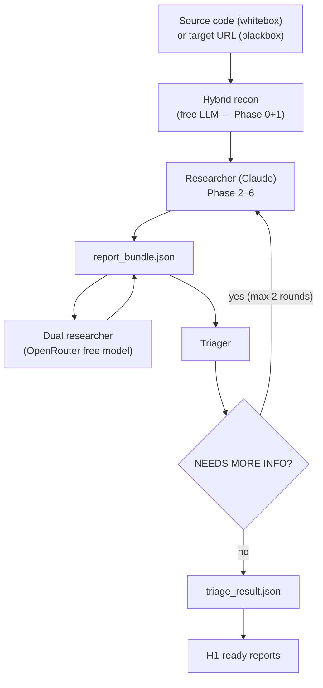
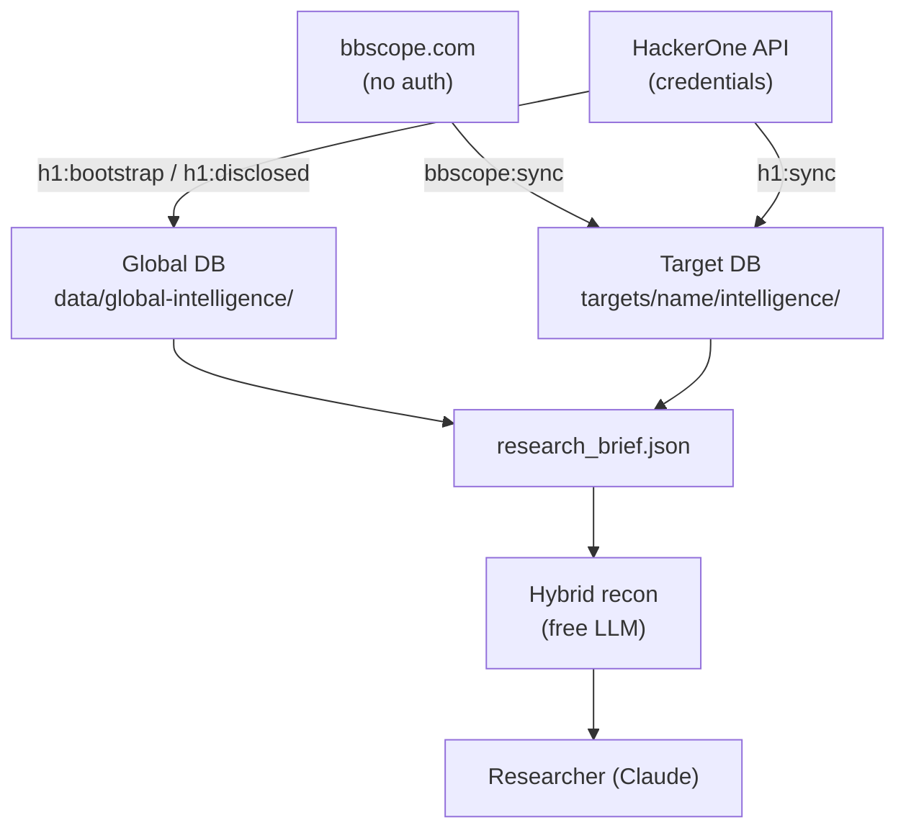
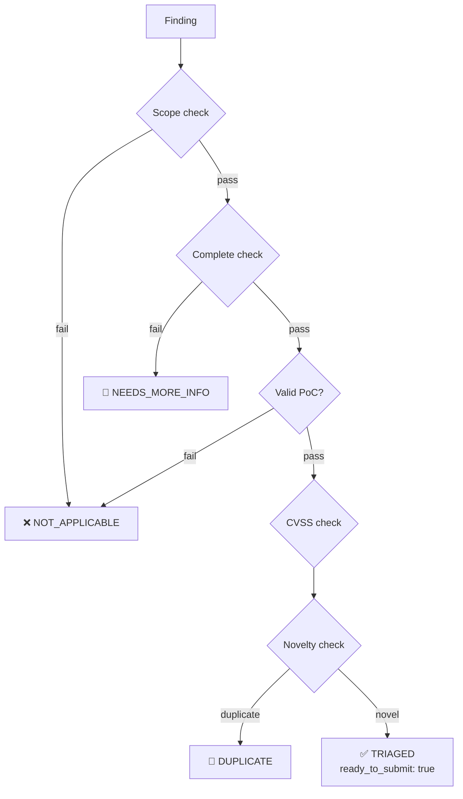

# Agentic BugBounty — Complete Guide

> **Design philosophy**: built around whitebox analysis — clone the source, point the agent at it, get deep findings with file:line precision and working PoCs. Blackbox mode is supported for targets where source is unavailable, but whitebox is the primary mode and delivers significantly higher signal quality.

---

## Table of Contents

1. [How it works](#how-it-works)
2. [Analysis modes](#analysis-modes)
3. [Target workspace](#target-workspace)
4. [Running the pipeline](#running-the-pipeline)
5. [Live agent output](#live-agent-output)
6. [PoC artifacts and summary](#poc-artifacts-and-summary)
7. [Interactive finding review](#interactive-finding-review)
8. [Session resume (Claude Pro usage limits)](#session-resume-claude-pro-usage-limits)
9. [Intelligence sources](#intelligence-sources)
10. [bbscope](#bbscope)
11. [HackerOne intelligence](#hackerone-intelligence)
12. [Skill library](#skill-library)
13. [CVE intel](#cve-intel)
14. [Hybrid recon (free LLM pre-pass)](#hybrid-recon-free-llm-pre-pass)
15. [Dual researcher (second AI pass)](#dual-researcher-second-ai-pass)
16. [OpenRouter — free models + key rotation](#openrouter--free-models--key-rotation)
17. [Intel UI](#intel-ui)
18. [Direct agent invocation](#direct-agent-invocation)
19. [JSON contracts](#json-contracts)
20. [Validation](#validation)
21. [Package scripts reference](#package-scripts-reference)
22. [Environment variables](#environment-variables)

---

## How it works

The pipeline runs two agents in sequence.



**One command runs everything.** `node scripts/run-pipeline.js` runs hybrid recon, then the Researcher, then the dual researcher pass, then the Triager. You do not need to run them separately unless you want manual control.

**Hybrid recon** runs Phase 0 (calibration briefing) and Phase 1 (source reconnaissance) using a free LLM via OpenRouter or Gemini CLI before Claude starts. The output — entry points, sink map, IPC channels, interesting patterns — is injected into the Claude prompt. Claude picks up at Phase 2 (static analysis) with the groundwork already done. If the free LLM is unavailable, Claude handles Phase 0+1 itself — no regression.

**Researcher** operates in whitebox or blackbox mode. It reads source files, traces data flows, confirms every candidate with a working PoC before writing to the bundle. For targets with multiple assets, it runs a separate pass per asset, appending findings to the same bundle. The pipeline pauses between passes.

**Dual researcher** runs a second pass after Claude using a different model via OpenRouter. It cross-validates findings and hunts for anything the first pass missed. New findings are merged into the bundle by deduplication on `affected_component + vulnerability_class`.

**Triager** runs six checks on every finding: scope, completeness, validity, CVSS reassessment, novelty (duplicate detection), and submission decision. Findings that need clarification get flagged as `NEEDS_MORE_INFO`, which triggers a second Researcher pass. This loops up to `--max-nmi-rounds` times (default 2).

**Deterministic fallback**: if the Triager agent fails to write `triage_result.json`, the pipeline runs a local Node.js triage pass with the same six checks.

---

## Analysis modes

| | Whitebox | Blackbox |
|---|---|---|
| Source required | Yes — clone or copy | No |
| Finding precision | File:line exact | Endpoint / behavior |
| PoC quality | Code-level, self-contained | HTTP/script-based |
| Coverage | Full codebase | Exposed surface only |
| Recommended | **Yes** | When source unavailable |

Set in `target.json`:

```json
{
  "default_mode": "whitebox",
  "allowed_modes": ["whitebox", "blackbox"]
}
```

Or override at runtime:

```bash
node scripts/run-pipeline.js --target acme --mode whitebox
node scripts/run-pipeline.js --target acme --mode blackbox
```

---

## Target workspace

### Create automatically (recommended)

Pass `--target <name>` to the pipeline. If the workspace does not exist, the setup wizard runs:

```bash
node scripts/run-pipeline.js --target acme --cli claude
```

```
Target 'acme' not found. Starting setup wizard...

HackerOne program URL (Enter to skip): https://hackerone.com/acme
HackerOne program handle (Enter to skip): acme

Workspace created: targets/acme

Place your source files in:
  targets/acme/src

  • clone a repo:  git clone <url> "targets/acme/src/<repo-name>"
  • copy a folder: xcopy /E /I <src> "targets/acme/src\<name>"

Press Enter when the source is ready...

────────────────────────────────────────────────────────────
Assets detected: 2
────────────────────────────────────────────────────────────

[1/2] ./src/acme-extension
  Detected as : Chrome Extension (name: "Acme", v1.4.2, MV3)
  Type options: webapp | chromeext | mobileapp | executable
  Confirm type [Enter = chromeext] or type to override:
  Analysis mode [Enter = whitebox] or blackbox:
  → chromeext | whitebox

[2/2] ./src/acme-api
  Detected as : Web App (Node.js)
  Confirm type [Enter = webapp] or type to override:
  Analysis mode [Enter = whitebox] or blackbox:
  → webapp | whitebox

────────────────────────────────────────────────────────────
Workspace ready: targets/acme
Assets configured: chromeext (./src/acme-extension), webapp (./src/acme-api)
────────────────────────────────────────────────────────────
```

The wizard:
1. Creates the workspace and shows where to place sources
2. Waits for you to clone/copy the repos
3. Scans every subdirectory in `src/` — detects asset type from marker files (`manifest.json`, `AndroidManifest.xml`, `build.gradle`, `next.config.js`, `go.mod`, PE/ELF magic bytes) and reads framework/version info where available
4. Shows each asset with its detected type and lets you confirm or override
5. Writes `target.json` with all assets — primary + `additional_assets`
6. Starts the pipeline

### Create manually

```bash
node scripts/new-target.js <name>
# place source in targets/<name>/src/
node scripts/setup-target.js <name> --detect
```

### Workspace layout

```
targets/<name>/
├── target.json                          machine config
├── CLAUDE.md                            target notes for agents
├── run.sh / run.cmd                     convenience wrappers
├── src/                                 target source code
├── findings/
│   ├── confirmed/report_bundle.json     confirmed findings
│   ├── unconfirmed/candidates.json      unconfirmed candidates
│   ├── triage_result.json               triager verdicts
│   └── h1_submission_ready/*.md         HackerOne-ready reports
├── poc/
│   ├── EXT-001_slug.html                extracted PoC files
│   └── summary.md                       vulnerability summary
├── logs/
│   └── pipeline-*.log
└── intelligence/
    ├── agentic-bugbounty.db
    ├── bbscope_scope_snapshot.json
    ├── h1_scope_snapshot.json
    ├── h1_vulnerability_history.json
    ├── h1_skill_suggestions.json
    ├── target_profile.json
    └── research_brief.json
```

### target.json

Minimal working config:

```json
{
  "schema_version": "1.0",
  "target_name": "Acme Corp",
  "asset_type": "webapp",
  "default_mode": "whitebox",
  "allowed_modes": ["whitebox", "blackbox"],
  "program_url": "https://hackerone.com/acme",
  "source_path": "./src",
  "findings_dir": "./findings",
  "h1_reports_dir": "./findings/h1_submission_ready",
  "logs_dir": "./logs",
  "intelligence_dir": "./intelligence",
  "hackerone": {
    "program_handle": "acme",
    "sync_enabled": true
  },
  "scope": {
    "in_scope": ["*.acme.com"],
    "out_of_scope": ["Self-XSS", "DoS"]
  },
  "rules": [
    "Never modify files in ./src",
    "Never test against production",
    "Confirm every finding dynamically before reporting"
  ]
}
```

For Bugcrowd programs, use `bugcrowd` instead of `hackerone`:

```json
{
  "program_url": "https://bugcrowd.com/engagements/acme",
  "bugcrowd": {
    "program_handle": "engagements/acme",
    "sync_enabled": false
  }
}
```

Multi-asset config:

```json
{
  "asset_type": "chromeext",
  "source_path": "./src/acme-extension",
  "additional_assets": [
    { "asset_type": "webapp", "source_path": "./src/acme-backend" }
  ]
}
```

**Asset types:** `webapp` `mobileapp` `chromeext` `executable`

**Report ID prefixes:** `WEB-NNN` `MOB-NNN` `EXT-NNN` `EXE-NNN`

---

## Running the pipeline

```bash
node scripts/run-pipeline.js --target <name> --cli claude
```

**Flags:**

| Flag | Default | Description |
|------|---------|-------------|
| `--target <name>` | — | Target name under `targets/` |
| `--cli claude\|codex` | `claude` | Agent backend |
| `--model <id>` | model default | Override model |
| `--asset <type>` | from target.json | Override asset type |
| `--mode whitebox\|blackbox` | from target.json | Override analysis mode |
| `--interactive` | off | Manual finding review before triage |
| `--max-nmi-rounds <n>` | 2 | Max NEEDS_MORE_INFO feedback loops |
| `--resume` | off | Resume from checkpoint after session limit |

**Environment overrides:**

```bash
AGENTIC_CLI=claude
AGENTIC_MODEL=claude-opus-4-6
```

---

## Live agent output

The pipeline streams every tool call as it happens:

```
[2026-03-20T20:08:07Z] Running hybrid recon (Phase 0+1) via free LLM...
  [hybrid-recon] phase 0: loading calibration briefing for chromeext...
  [hybrid-recon] phase 1: found 109 source files — sampling key files...
  [hybrid-recon] phase 1: asking free LLM to map attack surface...
  [llm] google/gemma-3-27b-it:free delivered. done.
[2026-03-20T20:08:14Z] Hybrid recon injected into researcher prompt

[2026-03-20T20:08:14Z] → Starting researcher[chromeext] agent
  [  12s] Bash       grep -r "postMessage" src/ --include="*.js"
  [  18s] Read       src/background/messaging.js
  [  34s] Grep       eval( src/
  [ 774s] Write      targets/acme/findings/confirmed/report_bundle.json

  [done] 774s | 87 tool call(s) | $1.2340 | in: 45.2k | out: 8.1k | cache_read: 182.3k | cache_create: 12.4k

[2026-03-20T20:21:22Z] ← researcher[chromeext] agent done in 774s
```

When the agent is reasoning between tool calls, a heartbeat fires every 15 seconds:

```
  ⏱  45s | 12 tool call(s)...
```

Token usage and cost are logged to `logs/pipeline-*.log` at the end of each agent phase.

---

## PoC artifacts and summary

After the Researcher phase, the pipeline automatically writes:

```
targets/<name>/poc/
  EXT-001_javascript_code_injection_via_url_path.html
  EXT-002_csp_bypass_via_inline_script.js
  summary.md
```

`summary.md` contains a findings overview table and full detail per finding: CVSS, CWE, component, steps, impact, remediation, observed result.

**Run standalone:**

```bash
node scripts/render-poc-artifacts.js findings/confirmed/report_bundle.json --poc-dir targets/<name>/poc
# or
npm run poc:render
```

---

## Interactive finding review

Add `--interactive` to pause after the Researcher and review each finding before triage:

```bash
node scripts/run-pipeline.js --target acme --cli claude --interactive
```

```
────────────────────────────────────────────────────────────────────────
MANUAL REVIEW — 3 finding(s) to validate before triage
────────────────────────────────────────────────────────────────────────

▶ [EXT-001] Content script postMessage handler lacks origin validation
   Severity  : High
   Component : background/messaging.js:47
   Summary   : Any frame can dispatch messages to the background page...
   PoC type  : js_console
   [y] approve  [n] reject  [v] view full PoC →
```

`[v]` expands the full PoC and step list in-place. `[n]` removes the finding from the bundle before the Triager sees it.

---

## Session resume (Claude Pro usage limits)

Claude Pro sessions have a rolling usage cap. If the cap hits mid-run, the pipeline saves a checkpoint and tells you exactly what to run when the session resets.

```
════════════════════════════════════════════════════════════════════════
SESSION LIMIT REACHED

Claude Pro usage cap hit during the researcher phase.
Checkpoint saved — no work lost.
  Checkpoint : targets/acme/logs/checkpoint.json

When your session resets, resume with:

  node scripts/run-pipeline.js --target acme --cli claude --resume

The pipeline will pick up exactly where it stopped.
════════════════════════════════════════════════════════════════════════
```

```bash
node scripts/run-pipeline.js --target acme --cli claude --resume
```

On resume:
- If phase was `researcher`: skips completed assets, injects resume hint into the agent prompt
- If phase was `triage`: skips researcher loop entirely, re-runs triage on existing bundle
- On clean completion, checkpoint is deleted

`--resume` with no checkpoint is a no-op — the pipeline starts fresh.

---

## Intelligence sources

### Intelligence flow



---

## bbscope

[bbscope.com](https://bbscope.com) aggregates scope data from HackerOne, Bugcrowd, Intigriti, and YesWeHack — no API credentials required.

```bash
npm run bbscope:doctor
node scripts/sync-bbscope-intel.js --target <name>
```

Auto-detects platform from `program_url` in `target.json`:
- `hackerone.com` → `h1`
- `bugcrowd.com` → `bc`
- `intigriti.com` → `it`
- `yeswehack.com` → `ywh`

Override with `--platform`:

```bash
node scripts/sync-bbscope-intel.js --target <name> --platform bc
node scripts/sync-bbscope-intel.js --target <name> --platform h1 --handle acme
```

For Bugcrowd programs with engagement paths (e.g. `/engagements/acme`), set `bugcrowd.program_handle` in `target.json`:

```json
{
  "bugcrowd": { "program_handle": "engagements/acme" }
}
```

Writes to `targets/<name>/intelligence/`:
- `bbscope_scope_snapshot.json`
- `agentic-bugbounty.db` (shared with H1 sync — scopes tagged `source: bbscope_<platform>`)

---

## HackerOne intelligence

### Setup

```bash
export H1_API_USERNAME="your_api_username"
export H1_API_TOKEN="your_api_token"
npm run h1:doctor
```

### Target-local sync

```bash
node scripts/sync-hackerone-intel.js --target <name>
# or
npm run h1:sync
```

Auto-runs at pipeline start when `hackerone.sync_enabled: true` in `target.json` and credentials are present.

### Global disclosed dataset

```bash
npm run h1:disclosed         # incremental sync
npm run h1:bootstrap         # full history backfill
```

Full history with a date window:

```bash
node scripts/sync-hackerone-disclosed.js --full-history --start-date 2025-01-01 --end-date 2026-01-01 --window-days 31
```

Writes to `data/global-intelligence/`.

### Calibration dataset

After syncing disclosed reports, build a queryable calibration index:

```bash
npm run calibration:sync
```

Classifies 12,000+ disclosed reports by `(asset_type, vuln_class)` and aggregates severity distributions, typical CWEs, and real `hacktivity_summary` excerpts.

Query the data:

```bash
# Severity distribution for a given asset type
node scripts/query-calibration.js --asset chromeext

# JSON output (used by hybrid recon and agents)
node scripts/query-calibration.js --asset webapp --vuln xss --json

# Real H1 report summaries
node scripts/query-calibration.js --asset webapp --vuln xss --behaviors --limit 5

# All asset types
node scripts/query-calibration.js --all
```

The **Researcher** queries this before touching the target (Phase 0 in direct mode, or it is injected by hybrid recon) to bias module loading toward historically rewarded vuln classes.

The **Triager** queries this at Check 4.5 to cross-check the researcher's severity claim against historical H1 triage outcomes.

### Research brief

```bash
node scripts/build-research-brief.js --target <name>
# or
npm run research:brief
```

Get prioritized research focus suggestions:

```bash
node scripts/recommend-research-focus.js --target <name>
# or
npm run research:focus
```

---

## Skill library

The skill library stores reusable attack techniques distilled from H1 disclosed reports by LLM analysis. Each skill captures how a real researcher exploited a vuln — specific enough to replicate.

### Extract skills

Requires a working LLM backend (Gemini CLI or OpenRouter key):

```bash
npm run calibration:extract-skills
```

Processes disclosed reports in batches of 30. Skips already-processed reports (incremental). Each skill is stored with: `title`, `technique`, `chain_steps`, `insight`, `bypass_of`, `severity_achieved`.

### Query skills

```bash
node scripts/query-skills.js --asset chromeext --limit 15
node scripts/query-skills.js --asset webapp --program hackerone --limit 10
node scripts/query-skills.js --asset webapp --vuln xss
node scripts/query-skills.js --asset webapp --json
```

### How the Researcher uses skills

Phase 0, step 0.5 — before touching any source file, the Researcher queries the skill library for the current asset type. It prioritizes:
- Skills with `bypass_of` set — patch bypass techniques to try immediately
- Skills with 3+ `chain_steps` — complex chains automated scanners miss
- Skills with `insight` — the non-obvious part to use as a first hypothesis

If the Researcher discovers a new technique during analysis, it documents it in the finding as an `extracted_skill` field, which the pipeline auto-persists to the skill library after the session.

---

## CVE intel

Per-target CVE database fetched from NVD, enriched with Exploit-DB PoC links, analyzed by LLM.

### Sync CVEs

```bash
node scripts/sync-cve-intel.js --target <name>
```

Options:

```bash
--no-analysis          skip LLM patch analysis (faster)
--max-age-days 0       force refresh even if recently synced
```

Keywords are auto-detected from `target.json`: `target_name`, Chrome extension name, `package.json` name, APK filename.

### Query CVEs

```bash
node scripts/query-cve-intel.js --target <name>
node scripts/query-cve-intel.js --target <name> --min-cvss 6.0
node scripts/query-cve-intel.js --target <name> --json
```

### How the Researcher uses CVEs

Phase 0, step 0.6 — after the skill library query, the Researcher checks CVEs for the target. For each CVE it verifies whether the target version is in `affected_versions`, reads `variant_hints` for specific functions to grep, and flags CVEs with high bypass likelihood for immediate attention.

---

## Hybrid recon (free LLM pre-pass)

Before invoking Claude, the pipeline runs Phase 0 and Phase 1 using a free LLM to save Claude tokens for the work that requires deep reasoning.

### What it does

**Phase 0** — runs `query-calibration.js` locally and captures the calibration briefing for the asset type. This is synchronous and zero-cost.

**Phase 1** — walks the source tree (up to 300 files), samples key files (manifest, config, auth, routing, entry points), and asks the free LLM to produce a structured recon map:
- entry points
- auth layer
- data sinks (`eval`, `innerHTML`, `exec`, query builders, etc.)
- IPC / messaging channels
- external comms
- interesting patterns worth investigating

The output is injected into the Claude prompt as a pre-computed context block. Claude starts directly at Phase 2 (static analysis) with the groundwork already done.

### Failure behaviour

If the free LLM is unavailable (no keys, all models failing, timeout), the hybrid recon returns null silently. The pipeline logs a warning and Claude handles Phase 0+1 itself — existing behaviour, no regression.

### Token savings

The primary savings are on file listing, structure mapping, and calibration loading — mechanical work that a smaller model handles fine. Claude's token budget goes toward taint tracing, fuzzing mindset analysis, PoC development, and CVSS reasoning.

---

## Dual researcher (second AI pass)

After the primary Claude researcher completes, the pipeline runs a second researcher pass using a different model via OpenRouter. This cross-validates findings and hunts for anything the first pass missed.

### How it works

1. Primary Claude researcher runs, produces `report_bundle.json`
2. Dual researcher is called with context of what Claude already found
3. It hunts for additional vulnerabilities on different components or attack surfaces
4. New findings are merged into the bundle — deduplication by `affected_component + vulnerability_class`

### Enable

Set any `OPENROUTER_API_KEY*` in `.env`. The dual pass activates automatically — no flag needed.

The pre-run banner shows its status:

```
    3. Dual pass     — enabled (6 api key(s) in rotation)
    3. Dual pass     — disabled (no OPENROUTER_API_KEY set)
```

### Configure the model

Edit `config/openrouter.json`:

```json
{
  "researcher_model": "google/gemma-3-27b-it:free"
}
```

Falls back to the free model chain if the primary model fails on all keys.

---

## OpenRouter — free models + key rotation

Used for: hybrid recon (Phase 0+1), skill extraction, CVE patch analysis, dual researcher pass.

### Model selection

Defined in `config/openrouter.json` → `free_models`. Models are tried in order. The framework distinguishes between:

- **HTTP 404** — model unavailable for this account. Skipped immediately, no key rotation attempted.
- **HTTP 401 / 429 / 503 / 502** — transient error. All keys rotated before moving to next model.

This means a 404 on the first model costs one request, not `N_keys` requests.

### API key rotation

Up to 6 keys can be set — all are pooled and rotated automatically:

```bash
OPENROUTER_API_KEY=key          # single-key shorthand
OPENROUTER_API_KEY_1=key1
OPENROUTER_API_KEY_2=key2
OPENROUTER_API_KEY_3=key3
OPENROUTER_API_KEY_4=key4
OPENROUTER_API_KEY_5=key5
```

### LLM backend priority

Every free LLM call follows this chain:

```
1. Gemini via ccw CLI (synchronous, free if ccw is installed)
2. OpenRouter model × key matrix (config order, 404-skip enabled)
3. Error — clear message, operation skipped gracefully
```

---

## Intel UI

```bash
node scripts/serve-intel-ui.js --target <name> --port 31337 --open
# or
npm run ui:intel
```

Open `http://127.0.0.1:31337`.

Includes: target config, structured scope, local history, skill suggestions, global DB navigator with search, filters, and pagination.

---

## Direct agent invocation

The agents are Claude Code slash commands. You can invoke them directly inside a Claude Code session:

```
/researcher --asset chromeext --mode whitebox ./src
/triager --asset chromeext
```

Optional flags for the Researcher:

```
/researcher --asset webapp --mode whitebox ./src --vuln cors,graphql --bypass xss_filter_evasion
```

`--vuln` loads specialized vulnerability modules (e.g. `cors`, `graphql`, `prototype_pollution`, `oauth`, `ssrf`).
`--bypass` loads filter evasion modules (e.g. `xss_filter_evasion`, `sqli_filter_evasion`, `waf_evasion`).

Bypass modules also auto-load on trigger conditions — HTTP 403 loads `waf_evasion`, blocked XSS payload loads `xss_filter_evasion + encoding`.

### Compose prompts manually (Codex)

```bash
node scripts/compose-agent-prompt.js researcher --asset chromeext --mode whitebox --target <name>
node scripts/compose-agent-prompt.js triager --asset chromeext --target <name>
```

---

## JSON contracts

### report_bundle.json (Researcher output)

```
meta.schema_version      "2.0"
meta.asset_type          webapp | mobileapp | chromeext | executable
findings[]
  report_id              WEB-001 / MOB-001 / EXT-001 / EXE-001
  finding_title
  severity_claimed       Critical | High | Medium | Low | Informative
  cvss_vector_claimed    CVSS:3.1/...
  cvss_score_claimed     0.0–10.0
  cwe_claimed            CWE-NNN: name
  vulnerability_class
  affected_component     file:line or endpoint
  summary
  steps_to_reproduce[]   ≥3 steps for confirmed findings
  poc_code               full self-contained PoC
  poc_type               html | curl | python | js_console | burp_request | gdb | other
  observed_result
  impact_claimed
  remediation_suggested
  vulnerable_code_snippet
    file                 relative path to vulnerable file
    line_start           start line (integer)
    line_end             end line (integer)
    snippet              verbatim source lines
    annotation           one sentence: which line is the root cause and why
  attack_flow_diagram    Mermaid sequenceDiagram or flowchart showing attacker→sink chain
  researcher_notes
  confirmation_status    confirmed | unconfirmed
```

### triage_result.json (Triager output)

```
results[]
  report_id
  triage_verdict         TRIAGED | NOT_APPLICABLE | NEEDS_MORE_INFO | DUPLICATE | INFORMATIVE
  ready_to_submit        true | false
  analyst_severity
  analyst_cvss_score
  analyst_cvss_vector
  cwe_confirmed
  triage_summary
  nmi_questions[]        populated when verdict = NEEDS_MORE_INFO
  duplicate_of           populated when verdict = DUPLICATE
  checks{}
    scope_pass
    complete_pass
    valid_pass
    cvss_pass
    novelty_pass
```

### Triage decision flow



### H1 universal auto-reject rules

Findings are automatically marked `NOT_APPLICABLE` if they are:
- Self-XSS without an external attack vector
- DoS / rate limiting
- Theoretical without a working PoC
- Missing security headers without demonstrated exploitability

---

## Validation

```bash
node scripts/validate-bundle.js findings/confirmed/report_bundle.json
node scripts/validate-triage-result.js findings/triage_result.json findings/confirmed/report_bundle.json
node scripts/validate-target-config.js targets/<name>/target.json
npm test
```

All validation runs automatically during the pipeline. Failures abort the run.

---

## Package scripts reference

### Pipeline

| Command | Description |
|---------|-------------|
| `npm run pipeline` | Run full pipeline for the default target |
| `npm test` | Contract regression tests |

### Target management

| Command | Description |
|---------|-------------|
| `npm run target:new` | Create a new target workspace scaffold |
| `npm run target:reset` | Wipe findings, logs, intel, poc — preserves src/ and target.json |
| `npm run target:setup` | Detect and configure assets in existing workspace |
| `npm run target:profile` | Build target profile JSON |

### Output

| Command | Description |
|---------|-------------|
| `npm run poc:render` | Extract PoC files + summary.md from bundle |
| `npm run reports:render` | Render H1-ready markdown from bundle + triage result |
| `npm run triage:local` | Run deterministic local triage (no agent) |

### Intelligence — HackerOne

| Command | Description |
|---------|-------------|
| `npm run h1:doctor` | Check H1 API credentials and connectivity |
| `npm run h1:sync` | Sync target-local scope + history from H1 |
| `npm run h1:disclosed` | Incremental sync of global disclosed reports |
| `npm run h1:bootstrap` | Full history backfill of global disclosed reports |

### Intelligence — bbscope

| Command | Description |
|---------|-------------|
| `npm run bbscope:doctor` | Check bbscope connectivity |
| `npm run bbscope:sync` | Sync scope from bbscope.com (no credentials) |

### Intelligence — calibration, skills, CVE

| Command | Description |
|---------|-------------|
| `npm run calibration:sync` | Classify disclosed reports into calibration patterns |
| `npm run calibration:query` | Query calibration dataset |
| `npm run calibration:extract-skills` | Extract hacker skill patterns (LLM batch) |
| `npm run skills:query` | Query the skill library |
| `npm run cve:sync` | Sync CVE intel for the default target |
| `npm run cve:query` | Query CVE intel for the default target |

### Research brief + focus

| Command | Description |
|---------|-------------|
| `npm run research:brief` | Build researcher intel brief |
| `npm run research:focus` | Get prioritized research focus suggestions |

### Validation + UI

| Command | Description |
|---------|-------------|
| `npm run validate:bundle` | Validate report_bundle.json against schema |
| `npm run validate:triage` | Validate triage_result.json against schema |
| `npm run validate:target` | Validate target.json against schema |
| `npm run ui:intel` | Serve local intel UI on port 31337 |

---

## Environment variables

| Variable | Required | Description |
|----------|----------|-------------|
| `H1_API_USERNAME` / `HACKERONE_API_USERNAME` | For H1 sync | HackerOne API username |
| `H1_API_TOKEN` / `HACKERONE_API_TOKEN` | For H1 sync | HackerOne API token |
| `OPENROUTER_API_KEY` | For dual researcher, hybrid recon, CVE analysis | Single key shorthand |
| `OPENROUTER_API_KEY_1` … `_5` | For key rotation | Additional keys — all pooled automatically |
| `AGENTIC_CLI` | No | Default CLI backend (`claude` or `codex`) |
| `AGENTIC_MODEL` | No | Default model override |

Copy `.env.example` to `.env` and fill in the values. The pipeline loads `.env` automatically — no need to export variables manually.

See `config/openrouter.json` to configure model priority and fallback order.
