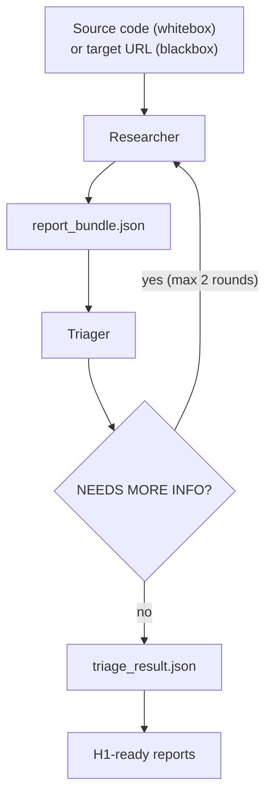
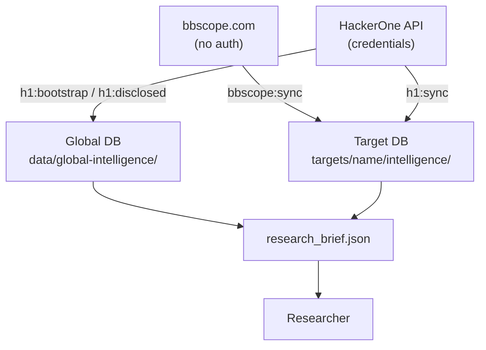
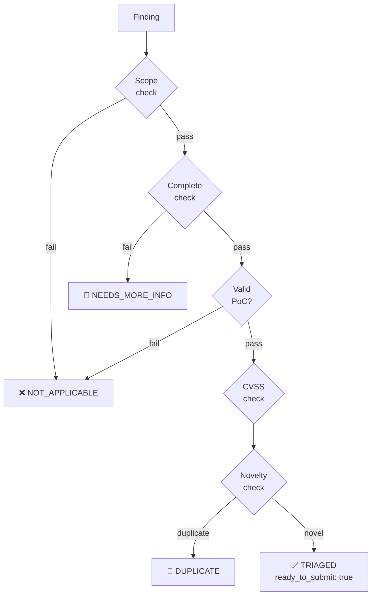

# Agentic BugBounty — Complete Guide

---

> **Design philosophy**: this framework is built around **whitebox analysis** — clone the source, point the agent at it, get deep findings with file:line precision and working PoCs. Blackbox mode is supported for targets where source is unavailable, but whitebox is the primary mode and delivers significantly higher signal quality.

---

## Table of Contents

1. [How it works](#how-it-works)
2. [Analysis modes](#analysis-modes)
3. [Target workspace](#target-workspace)
4. [Running the pipeline](#running-the-pipeline)
5. [Live agent output](#live-agent-output)
6. [PoC artifacts and summary](#poc-artifacts-and-summary)
7. [Interactive finding review](#interactive-finding-review)
8. [Session resume (Claude Pro usage limits)](#session-resume-claude-pro-usage-limits)
9. [Intelligence sources](#intelligence-sources)
10. [bbscope](#bbscope)
11. [HackerOne intelligence](#hackerone-intelligence)
    - [Global disclosed dataset](#global-disclosed-dataset)
    - [Calibration dataset](#calibration-dataset)
12. [Skill library](#skill-library)
13. [CVE intel](#cve-intel)
14. [Dual researcher (second AI pass)](#dual-researcher-second-ai-pass)
15. [OpenRouter — free models + key rotation](#openrouter--free-models--key-rotation)
16. [Intel UI](#intel-ui)
17. [Direct agent invocation](#direct-agent-invocation)
18. [JSON contracts](#json-contracts)
19. [Validation](#validation)
20. [Package scripts reference](#package-scripts-reference)
21. [Environment variables](#environment-variables)

---

## How it works

The pipeline runs two agents in sequence.



**One command runs both agents.** `node scripts/run-pipeline.js` launches the Researcher, waits for it to finish, then automatically launches the Triager. You do not need to run them separately unless you want manual control.

**Researcher** operates in either whitebox (source available) or blackbox mode. It loads a structured threat model for the asset type, consumes a pre-built intelligence brief, runs grep patterns, reads source files, and produces a `report_bundle.json` with confirmed findings — each with a full PoC, CVSS score, and reproduction steps. If the target has multiple assets (e.g. a Chrome extension + a backend API), the Researcher runs a separate pass per asset, appending findings to the same bundle. The pipeline pauses between passes so you can review before continuing.

**Triager** runs six checks on every finding: scope, completeness, validity, CVSS reassessment, novelty (duplicate detection against HackerOne history), and submission decision. Findings that need clarification get flagged as `NEEDS_MORE_INFO`, which triggers a second Researcher pass. This loops up to `--max-nmi-rounds` times (default 2).

**Deterministic fallback**: if the Triager agent fails to write `triage_result.json`, the pipeline runs a local Node.js triage pass with the same six checks and H1 universal rules.

---

## Analysis modes

| | Whitebox | Blackbox |
|---|---|---|
| Source required | Yes — clone or copy | No |
| Finding precision | File:line exact | Endpoint / behavior |
| PoC quality | Code-level, self-contained | HTTP/script-based |
| Coverage | Full codebase | Exposed surface only |
| Recommended | **Yes** | When source unavailable |

Set in `target.json`:

```json
{
  "default_mode": "whitebox",
  "allowed_modes": ["whitebox", "blackbox"]
}
```

Or override at runtime:

```bash
node scripts/run-pipeline.js --target acme --mode whitebox
node scripts/run-pipeline.js --target acme --mode blackbox
```

---

## Target workspace

### Create automatically (recommended)

Pass `--target <name>` to the pipeline. If the workspace does not exist, the setup wizard runs:

```bash
node scripts/run-pipeline.js --target acme --cli claude
```

```
Target 'acme' not found. Starting setup wizard...

HackerOne program URL (Enter to skip): https://hackerone.com/acme
HackerOne program handle (Enter to skip): acme

Workspace created: targets/acme

Place your source files in:
  targets/acme/src

  • clone a repo:  git clone <url> "targets/acme/src/<repo-name>"
  • copy a folder: xcopy /E /I <src> "targets/acme/src\<name>"

Press Enter when the source is ready...

────────────────────────────────────────────────────────────
Assets detected: 2
────────────────────────────────────────────────────────────

[1/2] ./src/acme-extension
  Detected as : Chrome Extension (name: "Acme", v1.4.2, MV3)
  Type options: webapp | chromeext | mobileapp | executable
  Confirm type [Enter = chromeext] or type to override:
  Analysis mode [Enter = whitebox] or blackbox:
  → chromeext | whitebox

[2/2] ./src/acme-api
  Detected as : Web App (Node.js)
  Type options: webapp | chromeext | mobileapp | executable
  Confirm type [Enter = webapp] or type to override:
  Analysis mode [Enter = whitebox] or blackbox:
  → webapp | whitebox

────────────────────────────────────────────────────────────
Workspace ready: targets/acme
Assets configured: chromeext (./src/acme-extension), webapp (./src/acme-api)
────────────────────────────────────────────────────────────
```

The wizard:
1. Creates the workspace and shows where to place sources
2. Waits for you to clone/copy the repos
3. Scans every subdirectory in `src/` — detects asset type from marker files (`manifest.json` + `manifest_version`, `AndroidManifest.xml`, `build.gradle`, `next.config.js`, `go.mod`, PE/ELF magic bytes, etc.) and reads framework/version info where available
4. Shows each asset with its detected type and lets you confirm or override
5. Writes `target.json` with all assets — primary + `additional_assets`
6. Starts the pipeline

Multiple assets get separate Researcher passes. The pipeline pauses between passes so you can review findings before continuing.

### Create manually

```bash
node scripts/new-target.js <name>
# place source in targets/<name>/src/
node scripts/setup-target.js <name> --detect
```

### Workspace layout

```
targets/<name>/
├── target.json                          machine config
├── CLAUDE.md                            target notes for agents
├── run.sh / run.cmd                     convenience wrappers
├── src/                                 target source code
├── findings/
│   ├── confirmed/report_bundle.json     confirmed findings
│   ├── unconfirmed/candidates.json      unconfirmed candidates
│   ├── triage_result.json               triager verdicts
│   └── h1_submission_ready/*.md         HackerOne-ready reports
├── poc/
│   ├── EXT-001_slug.html                extracted PoC files
│   └── summary.md                       vulnerability summary
├── logs/
│   └── pipeline-*.log
└── intelligence/
    ├── agentic-bugbounty.db
    ├── h1_scope_snapshot.json
    ├── h1_vulnerability_history.json
    ├── h1_skill_suggestions.json
    ├── target_profile.json
    └── research_brief.json
```

### target.json

Minimal working config:

```json
{
  "schema_version": "1.0",
  "target_name": "Acme Corp",
  "asset_type": "webapp",
  "default_mode": "whitebox",
  "allowed_modes": ["whitebox", "blackbox"],
  "program_url": "https://hackerone.com/acme",
  "source_path": "./src",
  "findings_dir": "./findings",
  "h1_reports_dir": "./findings/h1_submission_ready",
  "logs_dir": "./logs",
  "intelligence_dir": "./intelligence",
  "hackerone": {
    "program_handle": "acme",
    "sync_enabled": true
  },
  "scope": {
    "in_scope": ["*.acme.com"],
    "out_of_scope": ["Self-XSS", "DoS"]
  },
  "rules": [
    "Never modify files in ./src",
    "Never test against production",
    "Confirm every finding dynamically before reporting"
  ]
}
```

Multi-asset config:

```json
{
  "asset_type": "chromeext",
  "source_path": "./src/acme-extension",
  "additional_assets": [
    { "asset_type": "webapp", "source_path": "./src/acme-backend" }
  ]
}
```

**Asset types:** `webapp` `mobileapp` `chromeext` `executable`

**Report ID prefixes:** `WEB-NNN` `MOB-NNN` `EXT-NNN` `EXE-NNN`

---

## Running the pipeline

```bash
node scripts/run-pipeline.js --target <name> --cli claude
```

**Flags:**

| Flag | Default | Description |
|------|---------|-------------|
| `--target <name>` | — | Target name under `targets/` |
| `--cli claude\|codex` | `claude` | Agent backend |
| `--model <id>` | model default | Override model |
| `--asset <type>` | from target.json | Override asset type |
| `--mode whitebox\|blackbox` | from target.json | Override analysis mode |
| `--interactive` | off | Manual finding review before triage |
| `--max-nmi-rounds <n>` | 2 | Max NEEDS_MORE_INFO feedback loops |

**Environment overrides:**

```bash
AGENTIC_CLI=claude
AGENTIC_MODEL=claude-opus-4-6
```

**Per-target wrappers** (generated automatically):

```bash
# Linux / macOS
./targets/<name>/run.sh --cli claude

# Windows
targets\<name>\run.cmd --cli claude
```

---

## Live agent output

The pipeline streams every tool call as it happens:

```
[2026-03-20T20:08:07Z] → Starting researcher[chromeext] agent
  [  12s] Bash       grep -r "postMessage" src/ --include="*.js"
  [  18s] Read       src/background/messaging.js
  [  34s] Grep       eval( src/
  [ 774s] Write      targets/acme/findings/confirmed/report_bundle.json

  [done] 774s | 87 tool call(s) | $1.2340 | in: 45.2k | out: 8.1k | cache_read: 182.3k | cache_create: 12.4k

[2026-03-20T20:21:22Z] ← researcher[chromeext] agent done in 774s
```

When the agent is reasoning between tool calls, a heartbeat fires every 15 seconds:

```
  ⏱  45s | 12 tool call(s)...
```

After the Researcher completes, the pipeline prints the next command:

```
────────────────────────────────────────────────────────────────────────
Researcher done — 3 finding(s) confirmed.

To run the triager now:
  /triager --asset chromeext

Or run the full pipeline (researcher + triager) in one shot:
  node scripts/run-pipeline.js --target acme --cli claude
────────────────────────────────────────────────────────────────────────
```

Token usage and cost are logged to `logs/pipeline-*.log` at the end of each agent phase.

---

## PoC artifacts and summary

After the Researcher phase, the pipeline automatically writes:

```
targets/<name>/poc/
  EXT-001_javascript_code_injection_via_url_path.html
  EXT-002_csp_bypass_via_inline_script.js
  summary.md
```

`summary.md` contains:
- target metadata table
- analysis stats
- findings overview table (all findings at a glance)
- full detail section per finding: CVSS, CWE, component, steps, impact, remediation, observed result

**Run standalone:**

```bash
node scripts/render-poc-artifacts.js findings/confirmed/report_bundle.json --poc-dir targets/<name>/poc
```

Or:

```bash
npm run poc:render
```

---

## Interactive finding review

Add `--interactive` to pause after the Researcher and review each finding before triage:

```bash
node scripts/run-pipeline.js --target acme --cli claude --interactive
```

```
────────────────────────────────────────────────────────────────────────
MANUAL REVIEW — 3 finding(s) to validate before triage
────────────────────────────────────────────────────────────────────────

▶ [EXT-001] Content script postMessage handler lacks origin validation
   Severity  : High
   Component : background/messaging.js:47
   Summary   : Any frame can dispatch messages to the background page...
   PoC type  : js_console
   [y] approve  [n] reject  [v] view full PoC →
```

`[v]` expands the full PoC and step list in-place. `[n]` removes the finding from the bundle before the Triager sees it.

---

## Session resume (Claude Pro usage limits)

Claude Pro sessions have a rolling usage cap. If the cap hits mid-run, the pipeline detects it automatically, saves a checkpoint, and tells you exactly what to run when the session resets.

### How it works

1. `spawnClaude` streams JSON events from the agent
2. On `SessionLimitError` detected in the stream:
   - saves `targets/<name>/logs/checkpoint.json`
   - prints the exact resume command
   - exits cleanly
3. When the session resets, run with `--resume`:
   - if phase was **researcher**: skips completed assets, injects resume hint into prompt
   - if phase was **triage**: skips researcher loop, re-runs triage on existing bundle
4. On clean completion, checkpoint is deleted

### What gets saved

The checkpoint lives at `targets/<name>/logs/checkpoint.json`:

```json
{
  "phase": "researcher",
  "assetIndex": 0,
  "asset": "chromeext",
  "totalAssets": 1,
  "findingsCount": 3,
  "savedAt": "2026-03-21T22:00:00.000Z"
}
```

Everything written to `findings/confirmed/report_bundle.json` before the limit hit is preserved — the researcher picks up from where it stopped and is instructed not to re-analyse already-confirmed findings.

### When a limit hits

```
════════════════════════════════════════════════════════════════════════
SESSION LIMIT REACHED

Claude Pro usage cap hit during the researcher phase.
Checkpoint saved — no work lost.
  Checkpoint : targets/acme/logs/checkpoint.json

When your session resets, resume with:

  node scripts/run-pipeline.js --target acme --cli claude --resume

The pipeline will pick up exactly where it stopped.
════════════════════════════════════════════════════════════════════════
```

### Resuming

```bash
node scripts/run-pipeline.js --target acme --cli claude --resume
```

On resume the pipeline:

1. Loads `checkpoint.json` and prints what it found
2. If phase was `researcher`: skips assets already completed, injects a resume hint into the agent prompt (`N findings already confirmed, continue from where you left off`)
3. If phase was `triage`: skips the researcher loop entirely, re-runs triage on the existing bundle
4. On clean completion, deletes the checkpoint

### Notes

- `--resume` with no checkpoint is a no-op — the pipeline starts fresh
- Intelligence syncs (bbscope, HackerOne) are skipped on resume (already current)
- If you want to force a full re-run despite a checkpoint, delete `targets/<name>/logs/checkpoint.json` and run without `--resume`

---

## Intelligence sources

### Intelligence flow



---

## bbscope

[bbscope.com](https://bbscope.com) aggregates scope data from HackerOne, Bugcrowd, Intigriti, and YesWeHack — no API credentials required.

Use it to populate scope for any program, regardless of platform.

### Check connectivity

```bash
npm run bbscope:doctor
```

### Sync scope for a target

```bash
node scripts/sync-bbscope-intel.js --target <name>
# or
npm run bbscope:sync
```

Auto-detects platform from `program_url` in `target.json`. Override with `--platform`:

```bash
node scripts/sync-bbscope-intel.js --target <name> --platform bc   # Bugcrowd
node scripts/sync-bbscope-intel.js --target <name> --platform h1   # HackerOne
node scripts/sync-bbscope-intel.js --target <name> --platform it   # Intigriti
node scripts/sync-bbscope-intel.js --target <name> --platform ywh  # YesWeHack
```

Or specify the program handle directly:

```bash
node scripts/sync-bbscope-intel.js --target <name> --platform bc --handle my-program
```

Writes to `targets/<name>/intelligence/`:
- `bbscope_scope_snapshot.json`
- `agentic-bugbounty.db` (shared with H1 sync — scopes tagged `source: bbscope_<platform>`)

---

## HackerOne intelligence

### Setup

```bash
export H1_API_USERNAME="your_api_username"
export H1_API_TOKEN="your_api_token"
```

Check connectivity:

```bash
npm run h1:doctor
```

### Target-local sync

Fetches structured scope, accessible history, and derived skill suggestions for the target:

```bash
node scripts/sync-hackerone-intel.js --target <name>
# or
npm run h1:sync
```

Writes to `targets/<name>/intelligence/`.

Auto-runs at pipeline start when `hackerone.sync_enabled: true` in `target.json` and credentials are present.

### Global disclosed dataset

Builds a cross-program dataset from publicly disclosed HackerOne reports:

```bash
npm run h1:disclosed         # incremental sync
npm run h1:bootstrap         # full history backfill
```

Full history with a date window:

```bash
node scripts/sync-hackerone-disclosed.js --full-history --start-date 2025-01-01 --end-date 2026-01-01 --window-days 31
```

Writes to `data/global-intelligence/`.

### Calibration dataset

After syncing disclosed reports, build a queryable calibration index with severity distributions and real disclosure examples:

```bash
npm run calibration:sync
```

This classifies all 12,000+ disclosed reports by `(asset_type, vuln_class)` and aggregates:
- Severity distributions (critical/high/medium/low counts)
- Typical CWE and weakness per class
- Top programs by disclosure volume
- Real `hacktivity_summary` excerpts stored as behavior examples

Query the data:

```bash
# Severity distribution for all chromeext vuln classes
node scripts/query-calibration.js --asset chromeext

# Specific class, JSON output (for agent piping)
node scripts/query-calibration.js --asset webapp --vuln xss --json

# Real H1 report summaries — how researchers described the vuln and what triage validated
node scripts/query-calibration.js --asset webapp --vuln xss --behaviors --limit 5

# All asset types
node scripts/query-calibration.js --all
```

The **Researcher** queries this before touching the target (Phase 0) to bias module loading toward historically rewarded vuln classes and read real disclosure examples.

The **Triager** queries this at Check 4.5 to cross-check the researcher's severity claim against historical H1 triage outcomes for the same `(asset_type, vuln_class)` combination.

### Research brief

Build the intelligence brief the Researcher reads before touching the target:

```bash
node scripts/build-research-brief.js --target <name>
# or
npm run research:brief
```

Get prioritized research focus suggestions:

```bash
node scripts/recommend-research-focus.js --target <name>
# or
npm run research:focus
```

---

## Skill library

The skill library stores reusable attack techniques distilled from H1 disclosed reports by LLM analysis. Each skill captures how a real researcher exploited a vuln — specific enough to replicate.

### Extract skills from disclosed reports

Requires a working LLM backend (Gemini CLI or OpenRouter key):

```bash
npm run calibration:extract-skills
```

Processes all disclosed reports in batches of 30. Skips already-processed reports (incremental). Each skill is stored with: `title`, `technique`, `chain_steps`, `insight`, `bypass_of`, `severity_achieved`.

### Query skills

```bash
# All skills for an asset type
node scripts/query-skills.js --asset chromeext --limit 15

# Program-specific first, then global
node scripts/query-skills.js --asset webapp --program hackerone --limit 10

# Filter by vuln class
node scripts/query-skills.js --asset webapp --vuln xss

# JSON output
node scripts/query-skills.js --asset webapp --json
```

### How the Researcher uses skills

Phase 0, step 0.5 — before touching any source file, the Researcher queries the skill library for the current asset type. It prioritizes:
- Skills with `bypass_of` set — patch bypass techniques to try immediately
- Skills with 3+ `chain_steps` — complex chains automated scanners miss
- Skills with `insight` — the non-obvious part to use as a first hypothesis

If the Researcher discovers a new technique during analysis, it documents it in the finding as an `extracted_skill` field, which the pipeline auto-persists to the skill library after the session.

---

## CVE intel

Per-target CVE database enriched with patch analysis and variant hunting hints. Fetched from NVD, enriched with Exploit-DB PoC links, analyzed by LLM.

### Sync CVEs for a target

```bash
node scripts/sync-cve-intel.js --target <name>
# or via pipeline (auto-runs on every fresh start)
```

Options:

```bash
--no-analysis          skip LLM patch analysis (faster, saves API calls)
--max-age-days 0       force refresh even if recently synced (default: skip if < 1 day old)
```

Keywords are auto-detected from `target.json`: `target_name`, Chrome extension `manifest.json` name, `package.json` name, APK filename.

If no LLM backend is available, CVEs are saved without variant hints. A single clear message is printed instead of spamming per-CVE failures.

### Query CVEs

```bash
node scripts/query-cve-intel.js --target <name>
node scripts/query-cve-intel.js --target <name> --min-cvss 6.0
node scripts/query-cve-intel.js --target <name> --json
```

### How the Researcher uses CVEs

Phase 0, step 0.6 — after the skill library query, the Researcher checks CVEs for the target. For each CVE:
- Verifies if the target version is in `affected_versions`
- Reads `variant_hints` — specific functions/patterns to grep in the source
- Flags CVEs with `High bypass_likelihood` for immediate attention

---

## Dual researcher (second AI pass)

After the primary Claude researcher completes, the pipeline optionally runs a **second researcher pass** using a different AI model via OpenRouter. This cross-validates findings and hunts for anything the first pass missed.

### How it works

1. Primary Claude researcher runs, produces `report_bundle.json`
2. Dual researcher is called with context of what Claude already found (component + vuln class per finding)
3. It looks for additional vulnerabilities on **different components** or **different attack surfaces**
4. New findings are merged into the bundle — deduplication by `affected_component + vulnerability_class`
5. If all findings already overlap → nothing merged, logged as "no additional findings"

### Enable

Set any `OPENROUTER_API_KEY*` env var. The dual pass activates automatically — no flag needed.

If no key is set, the dual pass is silently skipped. The pre-run banner shows its status:

```
    3. Dual pass     — enabled (3 api key(s) in rotation)
    3. Dual pass     — disabled (no OPENROUTER_API_KEY set)
```

### Configure the model

Edit `config/openrouter.json`:

```json
{
  "researcher_model": "openai/gpt-oss-120b:free"
}
```

Falls back to the free model chain if the primary model fails on all keys.

---

## OpenRouter — free models + key rotation

The framework uses OpenRouter for two purposes:
1. **LLM batch work** — skill extraction, CVE patch analysis (free models)
2. **Dual researcher pass** — second opinion after Claude (configurable model)

### Free model list

Defined in `config/openrouter.json` → `free_models`. Models are tried in order; the framework switches to the next on any `401 / 429 / 503 / 502` error.

Current list (edit the file to change priority):

```
openai/gpt-oss-120b:free         ← researcher_model default
openai/gpt-oss-20b:free
meta-llama/llama-3.3-70b-instruct:free
qwen/qwen3-next-80b-a3b-instruct:free
qwen/qwen3-coder:free
nvidia/nemotron-3-super-120b-a12b:free
minimax/minimax-m2.5:free
nousresearch/hermes-3-llama-3.1-405b:free
arcee-ai/trinity-large-preview:free
... (22 models total)
```

### API key rotation

Up to 5 keys can be set — all are pooled and rotated automatically:

```bash
OPENROUTER_API_KEY=key1          # single-key shorthand
OPENROUTER_API_KEY_1=key1        # pooled rotation
OPENROUTER_API_KEY_2=key2
OPENROUTER_API_KEY_3=key3
OPENROUTER_API_KEY_4=key4
OPENROUTER_API_KEY_5=key5
```

On failure, the framework tries all keys for the current model before moving to the next model. Log output shows which key (last 4 chars) and model failed:

```
  [llm] rotating away from openai/gpt-oss-120b:free: HTTP 429: rate limited.
  [llm] switching api key (…ab12 failed on openai/gpt-oss-120b:free).
  [llm] trying openai/gpt-oss-120b:free (key …cd34)
  [llm] got a response from openai/gpt-oss-120b:free.
```

### LLM backend priority

Every LLM call follows this chain:

```
1. Gemini via ccw CLI (synchronous, free if ccw is installed)
2. OpenRouter model × key matrix (all combos, in config order)
3. Error — clear message, operation skipped gracefully
```

---

## Intel UI

```bash
node scripts/serve-intel-ui.js --target <name> --port 31337 --open
# or
npm run ui:intel
```

Open `http://127.0.0.1:31337`.

Includes: target config, structured scope, local history, skill suggestions, global DB navigator with search/filters/pagination, file browser.

---

## Direct agent invocation

The agents are Claude Code slash commands. You can invoke them directly inside a Claude Code session:

```
/researcher --asset chromeext --mode whitebox ./src
/triager --asset chromeext
```

Optional flags for the Researcher:

```
/researcher --asset webapp --mode whitebox ./src --vuln cors,graphql --bypass xss_filter_evasion
```

`--vuln` loads specialized vulnerability modules (e.g. `cors`, `graphql`, `prototype_pollution`, `oauth`, `ssrf`).
`--bypass` loads filter evasion modules (e.g. `xss_filter_evasion`, `sqli_filter_evasion`, `waf_evasion`).

Bypass modules also auto-load on trigger conditions — HTTP 403 loads `waf_evasion`, blocked XSS payload loads `xss_filter_evasion + encoding`.

### Compose prompts manually (Codex)

```bash
node scripts/compose-agent-prompt.js researcher --asset chromeext --mode whitebox --target <name>
node scripts/compose-agent-prompt.js triager --asset chromeext --target <name>
```

---

## JSON contracts

### report_bundle.json (Researcher output)

```
meta.schema_version      "2.0"
meta.asset_type          webapp | mobileapp | chromeext | executable
findings[]
  report_id              WEB-001 / MOB-001 / EXT-001 / EXE-001
  finding_title
  severity_claimed       Critical | High | Medium | Low | Informative
  cvss_vector_claimed    CVSS:3.1/...
  cvss_score_claimed     0.0–10.0
  cwe_claimed            CWE-NNN: name
  vulnerability_class
  affected_component     file:line or endpoint
  summary
  steps_to_reproduce[]   ≥3 steps for confirmed findings
  poc_code               full self-contained PoC
  poc_type               html | curl | python | js_console | burp_request | gdb | other
  observed_result
  impact_claimed
  remediation_suggested
  vulnerable_code_snippet
    file                 relative path to vulnerable file
    line_start           start line (integer)
    line_end             end line (integer)
    snippet              verbatim source lines — copied exactly from the file
    annotation           one sentence: which line is the root cause and why
  attack_flow_diagram    Mermaid sequenceDiagram or flowchart LR showing attacker→sink chain
  researcher_notes
  confirmation_status    confirmed | unconfirmed
```

### triage_result.json (Triager output)

```
results[]
  report_id
  triage_verdict         TRIAGED | NOT_APPLICABLE | NEEDS_MORE_INFO | DUPLICATE | INFORMATIVE
  ready_to_submit        true | false
  analyst_severity
  analyst_cvss_score
  analyst_cvss_vector
  cwe_confirmed
  triage_summary
  nmi_questions[]        populated when verdict = NEEDS_MORE_INFO
  duplicate_of           populated when verdict = DUPLICATE
  checks{}
    scope_pass
    complete_pass
    valid_pass
    cvss_pass
    novelty_pass
```

### Triage decision flow



### H1 universal auto-reject rules

Findings are automatically marked `NOT_APPLICABLE` if they are:
- Self-XSS without an external attack vector
- DoS / rate limiting
- Theoretical without a working PoC
- Missing security headers without demonstrated exploitability

---

## Validation

```bash
node scripts/validate-bundle.js findings/confirmed/report_bundle.json
node scripts/validate-triage-result.js findings/triage_result.json findings/confirmed/report_bundle.json
node scripts/validate-target-config.js targets/<name>/target.json
npm test
```

All validation runs automatically during the pipeline. Failures abort the run.

---

## Package scripts reference

### Pipeline

| Command | Description |
|---------|-------------|
| `npm run pipeline` | Run full pipeline for the default target (duckduckgo) |
| `npm test` | Contract regression tests (18 tests) |

### Target management

| Command | Description |
|---------|-------------|
| `npm run target:new` | Create a new target workspace scaffold |
| `npm run target:reset` | Wipe findings, logs, intel, poc — preserves src/ and target.json |
| `npm run target:setup` | Detect and configure assets in existing workspace |
| `npm run target:profile` | Build target profile JSON |

### Output

| Command | Description |
|---------|-------------|
| `npm run poc:render` | Extract PoC files + summary.md from bundle |
| `npm run reports:render` | Render H1-ready markdown from bundle + triage result |
| `npm run triage:local` | Run deterministic local triage (no agent) |

### Intelligence — HackerOne

| Command | Description |
|---------|-------------|
| `npm run h1:doctor` | Check H1 API credentials and connectivity |
| `npm run h1:sync` | Sync target-local scope + history from H1 |
| `npm run h1:disclosed` | Incremental sync of global disclosed reports |
| `npm run h1:bootstrap` | Full history backfill of global disclosed reports |

### Intelligence — calibration + skills + CVE

| Command | Description |
|---------|-------------|
| `npm run calibration:sync` | Classify disclosed reports into calibration patterns + behavior examples |
| `npm run calibration:query` | Query calibration dataset (human table output) |
| `npm run calibration:extract-skills` | Extract hacker skill patterns from disclosed reports (LLM batch) |
| `npm run skills:query` | Query the skill library |
| `npm run cve:sync` | Sync CVE intel for the default target |
| `npm run cve:query` | Query CVE intel for the default target |

### Research brief + scope

| Command | Description |
|---------|-------------|
| `npm run research:brief` | Build researcher intel brief |
| `npm run research:focus` | Get prioritized research focus suggestions |
| `npm run bbscope:doctor` | Check bbscope connectivity |
| `npm run bbscope:sync` | Sync scope from bbscope.com (no credentials) |

### Validation + UI

| Command | Description |
|---------|-------------|
| `npm run validate:bundle` | Validate report_bundle.json against schema |
| `npm run validate:triage` | Validate triage_result.json against schema |
| `npm run validate:target` | Validate target.json against schema |
| `npm run ui:intel` | Serve local intel UI on port 31337 |

---

## Environment variables

| Variable | Required | Description |
|----------|----------|-------------|
| `H1_API_USERNAME` / `HACKERONE_API_USERNAME` | For H1 sync | HackerOne API username |
| `H1_API_TOKEN` / `HACKERONE_API_TOKEN` | For H1 sync | HackerOne API token |
| `OPENROUTER_API_KEY` | For dual researcher + CVE analysis | Single key shorthand |
| `OPENROUTER_API_KEY_1` … `_5` | For key rotation | Additional keys — all pooled automatically |
| `AGENTIC_CLI` | No | Default CLI backend (`claude` or `codex`) |
| `AGENTIC_MODEL` | No | Default model override |

Copy `.env.example` to `.env` and fill in the values. See `config/openrouter.json` to configure model priority and fallback order.
